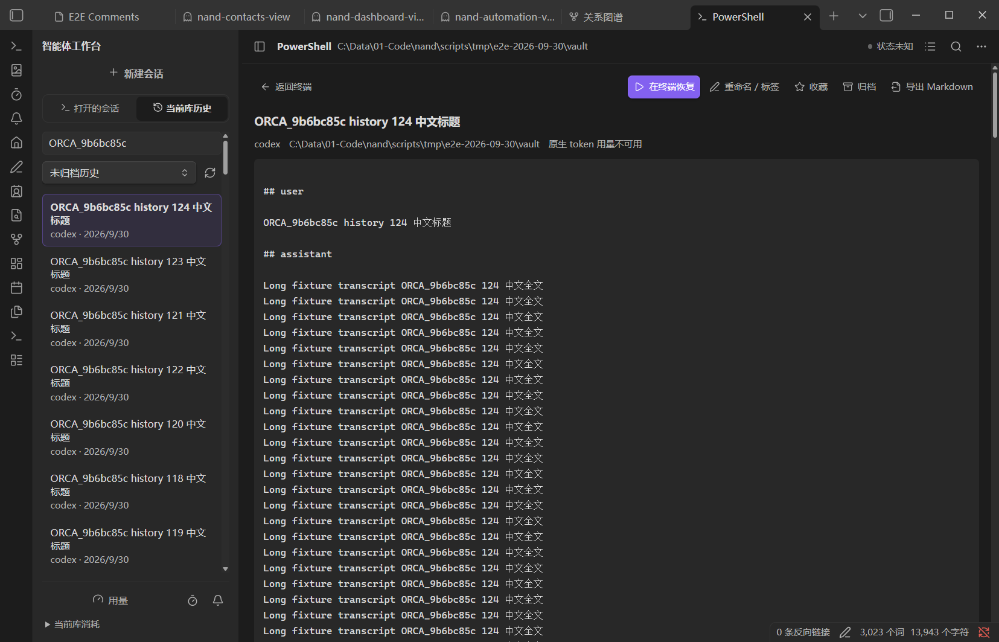

# 编程智能体工作台

工作台将运行中的终端、原生会话历史、自动化和用量放在同一视图中。支持 Claude Code、Codex、Gemini、OpenCode、Pi（`@mariozechner/pi-coding-agent`）与 Grok（`xai-org/grok-build`）。在设置中启用所需智能体，并先在本机完成 CLI 安装、登录和目录信任。

## 布局与会话

左上角“新建会话”菜单包含 Shell、已启用的智能体和自定义预设，下方有自动化、通知及运行中的会话。中间保留真实 xterm 终端；右侧为当前库的原生历史（状态栏菜单也使用相同索引）；底部显示库内 token 用量及订阅额度入口。窄窗会将历史放在终端下方。

关闭工作台标签会隐藏界面并保留进程，重新打开后可接回；会话旁的关闭按钮结束对应进程。停用终端模块或卸载插件会停止全部进程。Obsidian 重启后不会自动重新提交以前的提示词。CLI 的原生历史仍由 CLI 保存。

会话状态来自原生生命周期事件。Pi 等待 idle/settled；OpenCode 排除子会话和可恢复错误；没有可靠状态的会话显示未知。不会因为一段时间没有输出便宣告成功。

## 原生历史

历史仅接受工作目录经真实路径解析后位于当前库及子目录的会话。目录名相似、符号链接指向库外、缺少可信工作目录的信息都不能扩大范围。切换库后不会显示全局聊天记录。

可以搜索正文、标题及标签，预览完整文本，原生恢复会话，设置标题、标签、收藏、归档，或导出 Markdown。列表每页 100 条。恢复前再次检查工作目录和原生文件；指定会话不存在时报告错误，不静默创建新会话。

| CLI | 读取方式 |
|---|---|
| Claude Code | 选中配置目录的 `projects` JSONL |
| Codex | 选中 `CODEX_HOME` 的 `sessions` JSONL |
| Gemini | `.gemini/tmp/*/chats` 的 JSON/JSONL；工作目录来自记录、`.project_root` 或 `projects.json` |
| OpenCode | `opencode.db` 只读连接；读取根会话及消息／文本 part |
| Pi | `PI_CODING_AGENT_DIR/sessions` JSONL |
| Grok | `GROK_HOME/sessions` 中的 `session.json` 与 `chat_history.jsonl` |

NAND 的改名、标签、收藏和归档保存在 `.nand/terminal-agent/<device>/history.json`，不会修改原生日志。索引位于同目录的 `index.sqlite`，新导出通过 Vault 笔记接口写入可见的 `NAND Exports/`，完成后自动打开；文件浏览器和快速切换（Ctrl/Cmd+O）都可找到。重名会使用编号后缀，不覆盖已有文件。旧的 `.nand/terminal-agent/exports/` 内容保留原位。读取或保存失败会提示原因；若保存成功但打开失败，提示会给出已保存路径。历史不会实时自动刷新；需要最新记录时，使用刷新按钮。

## 额度与用量

订阅额度是提供方返回的账户状态，和 token 用量分开显示。弹窗显示提供方窗口／模型、剩余比例、重置时间、检查时间与来源。临时请求失败时保留最近一次有效结果并标记过期；没有有效结果时明确显示不可用。Gemini 保留每个模型自己的额度，不虚构统一周额度。Claude/Codex 使用当前选中的账户目录；macOS Claude 也读取对应的钥匙串凭据。

Token 来自原生日志。输入统一包含 cache read/write；缓存数字是输入中的明细，不能再与输入相加。Codex 取会话累计值，Claude 对同一消息的重复／更新用量去重。费用仅显示 CLI 原生记录值，不按模型价格推算。汇总有缺失会话时会标注“仅计入已知用量的会话”；任何会话费用缺失，汇总费用显示未知。

自动化使用运行前后原生累计值的差额。缺少基线或结束时日志尚未落盘，会缺少本次统计；获取用量有等待上限，失败不改变任务的原生完成结果。Pi 或其他没有订阅额度接口的提供方，不会伪造剩余百分比。

## 使用限制

先在本机安装并登录所需 CLI，完成它自己的目录信任和权限提示。工作台依赖桌面终端服务；Obsidian 退出后不能继续运行任务。

不同 CLI 提供的历史、完成事件和额度信息不同，缺失信息会显示未知或不可用。六种 CLI 的真实账号流程尚未全部验证，Windows、macOS 钥匙串和实际订阅额度仍需要在对应设备上确认。工作台截图用于说明布局，不表示这些场景均已验证。
