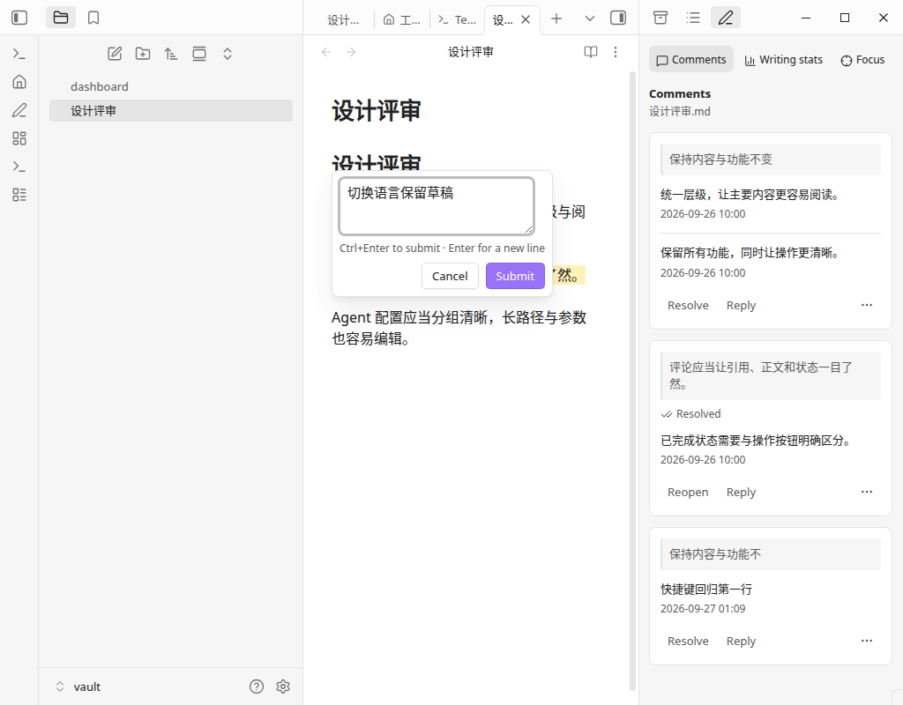
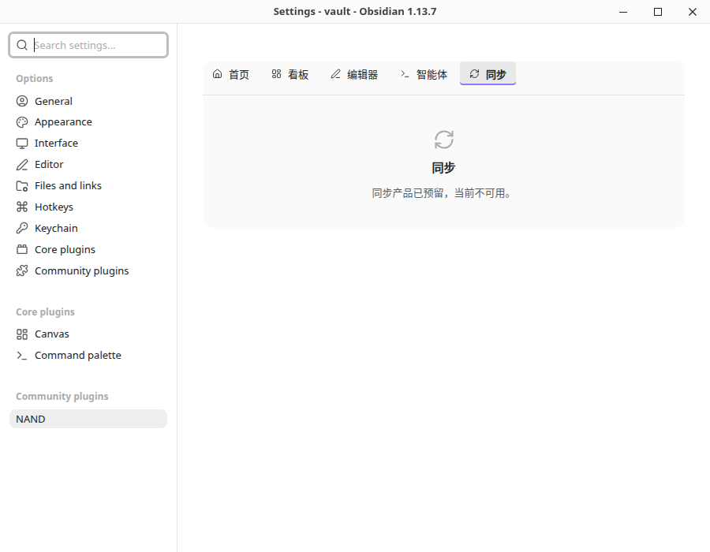

# Issue #17–#22 修复记录

基于 `f3b6162` 实施，范围不包含 #14。以下记录首次修复的验证结果。后续按项目尚未发布的要求，移除了迁移工具、版本标记和启动门禁；最新 issue 复核见 [最新复核与后续计划](issue-review-2026-09-27.md)。

| Issue | 已实施的修复 | 验证 |
|---|---|---|
| #17 原生路径丢失根目录 | 终端插件目录、Agent 上下文与 IDE bridge 使用原生路径函数，拒绝非绝对库根路径 | POSIX、Windows、UNC、自定义配置目录、中文、空格与字面 `%20` 单测；Linux 实例保持 cwd 为 `/srv/nand`，实际插件目录正确落在临时库内 |
| #18 评论浮层和快捷键 | 显式覆盖 `[hidden]`，提供提交/取消与快捷键说明；独立 Obsidian `Scope` 捕获 Mod+Enter；Enter 换行；空白内容、IME、重复提交及卸载清理保护 | 测试 Scope 生命周期、空白/重复提交、失败保留输入；Obsidian 中通过 CDP 键盘事件确认 Enter、Ctrl+Enter、Esc 行为 |
| #19 设置页空白与线条 | 去除原生分组包装层的额外 padding 和伪元素线；同步占位用内容高度 | 原生设置窗口包装层 padding 为 0、伪元素 content 为 none；同步占位高度 160，根容器 clientHeight 与 scrollHeight 都为 670 |
| #20 终端标题滞后 | 替换叶子与绑定终端实例后刷新 Obsidian 页签标题 | 关闭模块后标题/页签均为“智能体”，重新启用后均为 “Terminal” |
| #21 评论语言不即时更新 | 可取消订阅的语言事件；评论页、标签和输入组件更新文案，保留输入、焦点与滚动状态 | 中→英→中实时切换；同一窗口的直接回调验证中草稿、textarea 焦点保持（独立设置窗口切换后的焦点不作此保证）；测试重复设置相同语言不通知、取消订阅后不再通知 |
| #22 旧标识与保存失败 | 日历/背景保存注入当前设置访问接口，回调读取最新设置；终端视图注入控制器；统一命名空间 | 实际日历“未完成”在 UI、内存、磁盘均一致，重开仍保留；旧标识审计通过 |

命名空间涉及评论路径、视图、CSS、事件、MIME、库级界面状态、Electron 会话与终端标识。版权来源声明保留原文。当前直接使用新命名，不保留旧别名，不要求迁移。

## 首次修复的自动检查（提交 `1b4af50`）

- `pnpm run build`：通过，根目录 `main.js` 已重建。
- `pnpm run lint`：0 error，197 个既有 warning，无新增 warning。
- `package.json` 中全部 41 个 `test:*` 脚本通过；其中终端 179 项，设置相关 19 项。
- 新的 `test:issue-regressions` 覆盖评论输入/快捷键范围、语言通知和设置持久化/失败回退。
- 独立命名审计覆盖仓库文本和构建产物，通过；仅豁免版权来源声明。

## 实际环境和边界

在 Linux、Obsidian 1.13.7、临时库中复核。临时库的评论可正常读取。未操作个人库。

容器系统文件监听额度耗尽（ENOSPC），因此仅在测试实例禁用文件监听并手动加载库/布局后验证。该结果不等同于完整文件监听端到端测试。Windows/UNC 仅使用 Node 的 `win32` 路径规则单测；macOS Cmd 快捷键、真实移动设备、旧版 Obsidian 设置回退及跨设备同步未做实机验收。新 Electron 会话需要重新登录，未进行账户登录验证。

## 界面证据

