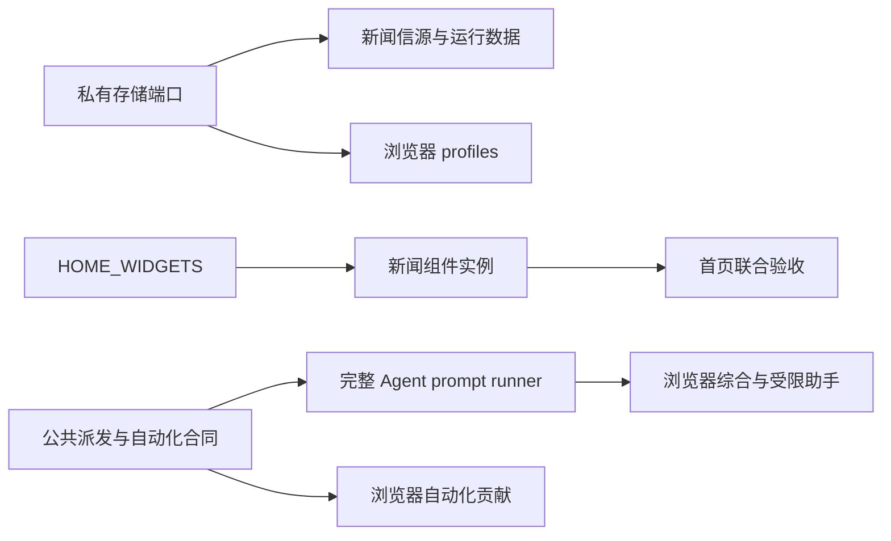

<!-- ACCEPTANCE-20261011:START -->
2026-10-11 完成与归档记录：[最终验收](evidence/completion.md)。用户确认本轮以 Windows 验收为准，真实账号及其他平台保留未验证记录，不再作为本轮完成阻塞。历史规划与早期审查原文保留；当前状态、授权、提交和验收结论以本补充及正式状态为准。
<!-- ACCEPTANCE-20261011:END -->

# NAND 全部 open issue — 总体实施图

<!-- ACTUAL-CODE-REVIEW:START -->
2026-10-11 实际代码审查与修复见 [review-report.md](review-report.md) 和 [review-progress.json](review-progress.json)。已逐项审查61票／180条AC；原规划文本、阶段 Gate 与历史授权说明保留为历史记录。用户当前已授权自主代码修复，未要求提交、推送、发版或关闭 issue；不以规划阶段“0/61／只规划”描述当前工作区，也不把真实账号或未跑平台 Gate 视为通过。
<!-- ACTUAL-CODE-REVIEW:END -->

## 1. Members and Source Authority

本图只组合，不复制或替代子Spec/Ticket。来源为13个open issue完整正文/评论快照、固定参考和用户确认。本轮只规划；全部61票未实施。

| 成员 | Issue | Spec | Tickets Map | 局部Goal |
|---|---|---|---|---|
| 工作台导航、常规设置与图标语言回归 | #138,#139,#140 | <Path>{roots.state}/specdev/changes/2026-10-08-workbench-regressions/spec.md</Path> | <Path>{roots.state}/specdev/changes/2026-10-08-workbench-regressions/tickets-map.md</Path> | <Path>{roots.state}/specdev/changes/2026-10-08-workbench-regressions/goal-plan.md</Path> |
| 终端 helper 可安装性、错误反馈与句柄隔离 | #135,#143 | <Path>{roots.state}/specdev/changes/2026-10-08-terminal-reliability/spec.md</Path> | <Path>{roots.state}/specdev/changes/2026-10-08-terminal-reliability/tickets-map.md</Path> | <Path>{roots.state}/specdev/changes/2026-10-08-terminal-reliability/goal-plan.md</Path> |
| NAND 私有目录和文件的最小POSIX权限 | #144 | <Path>{roots.state}/specdev/changes/2026-10-08-private-storage-permissions/spec.md</Path> | <Path>{roots.state}/specdev/changes/2026-10-08-private-storage-permissions/tickets-map.md</Path> | <Path>{roots.state}/specdev/changes/2026-10-08-private-storage-permissions/goal-plan.md</Path> |
| 档案列表、卡片与正文检索的完整核销 | #124 | <Path>{roots.state}/specdev/changes/2026-10-08-archives-completion/spec.md</Path> | <Path>{roots.state}/specdev/changes/2026-10-08-archives-completion/tickets-map.md</Path> | <Path>{roots.state}/specdev/changes/2026-10-08-archives-completion/goal-plan.md</Path> |
| Git 同步对照补齐、仓库边界与失败恢复 | #134 | <Path>{roots.state}/specdev/changes/2026-10-08-git-sync-parity/spec.md</Path> | <Path>{roots.state}/specdev/changes/2026-10-08-git-sync-parity/tickets-map.md</Path> | <Path>{roots.state}/specdev/changes/2026-10-08-git-sync-parity/goal-plan.md</Path> |
| 首页看板自由网格、组件贡献与智能体技能派发 | #137,#141 | <Path>{roots.state}/specdev/changes/2026-10-08-home-grid-rebuild/spec.md</Path> | <Path>{roots.state}/specdev/changes/2026-10-08-home-grid-rebuild/tickets-map.md</Path> | <Path>{roots.state}/specdev/changes/2026-10-08-home-grid-rebuild/goal-plan.md</Path> |
| 本地新闻工作台与 Agent 分析 | #136 | <Path>{roots.state}/specdev/changes/2026-10-08-news-aihot/spec.md</Path> | <Path>{roots.state}/specdev/changes/2026-10-08-news-aihot/tickets-map.md</Path> | <Path>{roots.state}/specdev/changes/2026-10-08-news-aihot/goal-plan.md</Path> |
| 浏览器快捷键修复与多 AI 工作台、受限网页助手 | #142,#145 | <Path>{roots.state}/specdev/changes/2026-10-08-browser-ai-workbench/spec.md</Path> | <Path>{roots.state}/specdev/changes/2026-10-08-browser-ai-workbench/tickets-map.md</Path> | <Path>{roots.state}/specdev/changes/2026-10-08-browser-ai-workbench/goal-plan.md</Path> |

## 2. Composite Ticket Inventory

| 复合ID | 交付 | Kind/Depth | 合同 | 原票 |
|---|---|---|---|---|
| 2026-10-08-workbench-regressions::T-01 | 修复覆盖层下单击导航与焦点范围 | bug/standard | AC-001,AC-002 | <Path>{roots.state}/specdev/changes/2026-10-08-workbench-regressions/ticket/01-overlay-rail-navigation.md</Path> |
| 2026-10-08-workbench-regressions::T-02 | 统一两个设置宿主的模块图标布局 | bug/lite | AC-003 | <Path>{roots.state}/specdev/changes/2026-10-08-workbench-regressions/ticket/02-settings-module-icons.md</Path> |
| 2026-10-08-workbench-regressions::T-03 | 刷新原生下拉的语言与尺寸 | bug/standard | AC-004,AC-005 | <Path>{roots.state}/specdev/changes/2026-10-08-workbench-regressions/ticket/03-localized-dropdown-sizing.md</Path> |
| 2026-10-08-terminal-reliability::T-01 | 修复 helper 下载失败的HTTP与网络反馈 | bug/standard | AC-001,AC-002,AC-003 | <Path>{roots.state}/specdev/changes/2026-10-08-terminal-reliability/ticket/01-download-diagnostics.md</Path> |
| 2026-10-08-terminal-reliability::T-02 | 在 helper 最早入口关闭继承的Unix描述符 | bug/deep | AC-004,AC-005 | <Path>{roots.state}/specdev/changes/2026-10-08-terminal-reliability/ticket/02-unix-inherited-fds.md</Path> |
| 2026-10-08-private-storage-permissions::T-01 | 在桌面存储边界统一创建和升级权限 | bug/deep | AC-001,AC-002,AC-003,AC-004,AC-006 | <Path>{roots.state}/specdev/changes/2026-10-08-private-storage-permissions/ticket/01-posix-private-storage.md</Path> |
| 2026-10-08-private-storage-permissions::T-02 | 覆盖原生历史索引和SQLite旁文件权限 | bug/deep | AC-005 | <Path>{roots.state}/specdev/changes/2026-10-08-private-storage-permissions/ticket/02-native-history-permissions.md</Path> |
| 2026-10-08-archives-completion::T-01 | 核销档案双布局、全文搜索与规模行为 | documentation/standard | AC-001,AC-002,AC-003,AC-004,AC-005,AC-006,AC-007,AC-008 | <Path>{roots.state}/specdev/changes/2026-10-08-archives-completion/ticket/01-close-parity-evidence.md</Path> |
| 2026-10-08-git-sync-parity::T-01 | 阻止库外暂存混入并明确私有数据同步范围 | bug/deep | AC-004,AC-005 | <Path>{roots.state}/specdev/changes/2026-10-08-git-sync-parity/ticket/01-vault-index-boundary.md</Path> |
| 2026-10-08-git-sync-parity::T-02 | 补齐到新空目录的Git clone引导 | feature/deep | AC-002,AC-003 | <Path>{roots.state}/specdev/changes/2026-10-08-git-sync-parity/ticket/02-safe-clone-onboarding.md</Path> |
| 2026-10-08-git-sync-parity::T-03 | 固定实际推送目标并保护压缩失败恢复 | bug/deep | AC-006,AC-010 | <Path>{roots.state}/specdev/changes/2026-10-08-git-sync-parity/ticket/03-push-target-squash.md</Path> |
| 2026-10-08-git-sync-parity::T-04 | 完成同步参考对照、宿主恢复与平台说明 | documentation/standard | AC-001,AC-007,AC-008,AC-009,AC-011 | <Path>{roots.state}/specdev/changes/2026-10-08-git-sync-parity/ticket/04-sync-parity-and-recovery.md</Path> |
| 2026-10-08-home-grid-rebuild::T-01 | 修复窄桌面快捷创建栏高度与横幅遮挡 | bug/standard | AC-001,AC-002,AC-003 | <Path>{roots.state}/specdev/changes/2026-10-08-home-grid-rebuild/ticket/01-quicknote-layout.md</Path> |
| 2026-10-08-home-grid-rebuild::T-02 | 建立按看板布局选择与保真迁移、固定参考来源 | feature/deep | AC-004,AC-005,AC-006,AC-007 | <Path>{roots.state}/specdev/changes/2026-10-08-home-grid-rebuild/ticket/02-board-layout-and-provenance.md</Path> |
| 2026-10-08-home-grid-rebuild::T-03 | 以HOME_WIDGETS统一内外部组件与按板成员 | feature/deep | AC-008,AC-009,AC-010,AC-011 | <Path>{roots.state}/specdev/changes/2026-10-08-home-grid-rebuild/ticket/03-home-widget-contributions.md</Path> |
| 2026-10-08-home-grid-rebuild::T-04 | 接通沉浸式统一网格、数据与真实渲染 | feature/deep | AC-012,AC-013,AC-014,AC-015 | <Path>{roots.state}/specdev/changes/2026-10-08-home-grid-rebuild/ticket/04-immersive-grid-surface.md</Path> |
| 2026-10-08-home-grid-rebuild::T-05 | 完成网格pointer与键盘移动缩放、取消和响应式 | feature/deep | AC-016,AC-017,AC-018,AC-019,AC-020 | <Path>{roots.state}/specdev/changes/2026-10-08-home-grid-rebuild/ticket/05-immersive-accessible-interaction.md</Path> |
| 2026-10-08-home-grid-rebuild::T-06 | 完成就地实例创建与看板/成员管理 | feature/standard | AC-021,AC-022,AC-023 | <Path>{roots.state}/specdev/changes/2026-10-08-home-grid-rebuild/ticket/06-widget-catalog-and-board-management.md</Path> |
| 2026-10-08-home-grid-rebuild::T-07 | 建立公共技能模板、可编辑预览与新会话派发 | feature/deep | AC-024,AC-025,AC-026,AC-027,AC-028,AC-029,AC-030 | <Path>{roots.state}/specdev/changes/2026-10-08-home-grid-rebuild/ticket/07-shared-agent-shortcut-dispatch.md</Path> |
| 2026-10-08-home-grid-rebuild::T-08 | 接通既有会话只粘贴与各入口上下文技能 | feature/deep | AC-031,AC-032,AC-033,AC-034,AC-035 | <Path>{roots.state}/specdev/changes/2026-10-08-home-grid-rebuild/ticket/08-existing-session-context-shortcuts.md</Path> |
| 2026-10-08-home-grid-rebuild::T-09 | 实现技能发现、记忆与目标能力选择器 | feature/standard | AC-036,AC-037,AC-038,AC-039 | <Path>{roots.state}/specdev/changes/2026-10-08-home-grid-rebuild/ticket/09-agent-skill-discovery.md</Path> |
| 2026-10-08-home-grid-rebuild::T-10 | 交付工作流分区的阶段推进、任务提醒与技能 | feature/deep | AC-040,AC-041,AC-042,AC-043,AC-044,AC-045,AC-046,AC-047 | <Path>{roots.state}/specdev/changes/2026-10-08-home-grid-rebuild/ticket/10-workflow-section.md</Path> |
| 2026-10-08-home-grid-rebuild::T-11 | 支持多模板新建笔记并保留旧单模板 | feature/standard | AC-048,AC-049,AC-050 | <Path>{roots.state}/specdev/changes/2026-10-08-home-grid-rebuild/ticket/11-multi-note-templates.md</Path> |
| 2026-10-08-home-grid-rebuild::T-12 | 交付每分区表格列显隐与排序 | feature/standard | AC-051,AC-052,AC-053 | <Path>{roots.state}/specdev/changes/2026-10-08-home-grid-rebuild/ticket/12-table-column-preferences.md</Path> |
| 2026-10-08-home-grid-rebuild::T-13 | 限制大库分组和看板的同步渲染量 | feature/standard | AC-054,AC-055,AC-056 | <Path>{roots.state}/specdev/changes/2026-10-08-home-grid-rebuild/ticket/13-progressive-group-rendering.md</Path> |
| 2026-10-08-home-grid-rebuild::T-14 | 实现有明确缺失日期规则的农历纪念日 | feature/deep | AC-057,AC-058,AC-059,AC-060 | <Path>{roots.state}/specdev/changes/2026-10-08-home-grid-rebuild/ticket/14-lunar-anniversaries.md</Path> |
| 2026-10-08-home-grid-rebuild::T-15 | 支持封面和横幅逐图焦点调整 | feature/standard | AC-061,AC-062,AC-063 | <Path>{roots.state}/specdev/changes/2026-10-08-home-grid-rebuild/ticket/15-image-focal-points.md</Path> |
| 2026-10-08-home-grid-rebuild::T-16 | 保存并应用全局主题与首页组合外观 | feature/deep | AC-064,AC-065,AC-066,AC-067 | <Path>{roots.state}/specdev/changes/2026-10-08-home-grid-rebuild/ticket/16-named-global-appearance.md</Path> |
| 2026-10-08-home-grid-rebuild::T-17 | 补齐全量图标选择与文件卡快捷删除 | feature/standard | AC-068,AC-069,AC-070,AC-071 | <Path>{roots.state}/specdev/changes/2026-10-08-home-grid-rebuild/ticket/17-icons-and-card-delete.md</Path> |
| 2026-10-08-home-grid-rebuild::T-18 | 完成看板与新闻智能体的联合验收和交付文档 | documentation/deep | AC-072,AC-073,AC-074,AC-075,AC-076,AC-077 | <Path>{roots.state}/specdev/changes/2026-10-08-home-grid-rebuild/ticket/18-integrated-home-acceptance.md</Path> |
| 2026-10-08-news-aihot::T-01 | 配置信源、阅读原始新闻并收藏 | feature/deep | AC-001,AC-002,AC-003,AC-004,AC-005,AC-021 | <Path>{roots.state}/specdev/changes/2026-10-08-news-aihot/ticket/01-raw-news-and-collection.md</Path> |
| 2026-10-08-news-aihot::T-02 | 复用 Agent 并可靠读回完整结构化答案 | feature/deep | AC-006,AC-007 | <Path>{roots.state}/specdev/changes/2026-10-08-news-aihot/ticket/02-agent-structured-prompt-runner.md</Path> |
| 2026-10-08-news-aihot::T-03 | 批量分析精选并控制额度 | feature/deep | AC-008,AC-009,AC-010,AC-011,AC-012 | <Path>{roots.state}/specdev/changes/2026-10-08-news-aihot/ticket/03-featured-analysis-and-receipts.md</Path> |
| 2026-10-08-news-aihot::T-04 | 归组同一发生与后续事件 | feature/deep | AC-013,AC-014 | <Path>{roots.state}/specdev/changes/2026-10-08-news-aihot/ticket/04-event-occurrences-and-representative.md</Path> |
| 2026-10-08-news-aihot::T-05 | 展示可信热点趋势与七天曲线 | feature/deep | AC-015,AC-016,AC-017 | <Path>{roots.state}/specdev/changes/2026-10-08-news-aihot/ticket/05-hot-ranking-and-observation-history.md</Path> |
| 2026-10-08-news-aihot::T-06 | 编排今日要闻与保存我的视图 | feature/deep | AC-018,AC-019 | <Path>{roots.state}/specdev/changes/2026-10-08-news-aihot/ticket/06-daily-edition-and-saved-views.md</Path> |
| 2026-10-08-news-aihot::T-07 | 生成深入了解简报并连接阅读动作 | feature/deep | AC-020,AC-022,AC-026 | <Path>{roots.state}/specdev/changes/2026-10-08-news-aihot/ticket/07-briefs-reader-actions-and-notifications.md</Path> |
| 2026-10-08-news-aihot::T-08 | 在首页添加独立新闻小组件实例 | feature/deep | AC-023 | <Path>{roots.state}/specdev/changes/2026-10-08-news-aihot/ticket/08-home-news-widgets.md</Path> |
| 2026-10-08-news-aihot::T-09 | 导入订阅并采集静态网页列表 | feature/standard | AC-024,AC-025 | <Path>{roots.state}/specdev/changes/2026-10-08-news-aihot/ticket/09-opml-and-static-web-sources.md</Path> |
| 2026-10-08-news-aihot::T-10 | 完成参考归因、用户文档与宿主验收 | feature/deep | AC-027,AC-028 | <Path>{roots.state}/specdev/changes/2026-10-08-news-aihot/ticket/10-reference-docs-and-runtime-acceptance.md</Path> |
| 2026-10-08-browser-ai-workbench::T-01 | 修复地址栏与工具栏 Mod+F / Mod+L | bug/standard | AC-001,AC-002 | <Path>{roots.state}/specdev/changes/2026-10-08-browser-ai-workbench/ticket/01-browser-host-shortcuts.md</Path> |
| 2026-10-08-browser-ai-workbench::T-02 | 默认兼容的多账号 profile 与显式页面控制 | feature/deep | AC-003,AC-004,AC-024,AC-026,AC-039 | <Path>{roots.state}/specdev/changes/2026-10-08-browser-ai-workbench/ticket/02-profile-page-control.md</Path> |
| 2026-10-08-browser-ai-workbench::T-03 | 交付 DeepSeek 任务到当前轮答案的源码 PoC | feature/deep | AC-005,AC-007,AC-010,AC-012,AC-016,AC-026 | <Path>{roots.state}/specdev/changes/2026-10-08-browser-ai-workbench/ticket/03-deepseek-workspace-poc.md</Path> |
| 2026-10-08-browser-ai-workbench::T-04 | 交付 Kimi 真实单站闭环 PoC | feature/deep | AC-013,AC-007,AC-016,AC-026 | <Path>{roots.state}/specdev/changes/2026-10-08-browser-ai-workbench/ticket/04-kimi-workspace-poc.md</Path> |
| 2026-10-08-browser-ai-workbench::T-05 | 交付 ChatGPT 真实单站闭环 PoC | feature/deep | AC-014,AC-007,AC-016,AC-026 | <Path>{roots.state}/specdev/changes/2026-10-08-browser-ai-workbench/ticket/05-chatgpt-workspace-poc.md</Path> |
| 2026-10-08-browser-ai-workbench::T-06 | 三站统一发送、部分失败恢复与真实 PoC Gate | feature/deep | AC-006,AC-008,AC-009,AC-010,AC-011,AC-015,AC-024,AC-025 | <Path>{roots.state}/specdev/changes/2026-10-08-browser-ai-workbench/ticket/06-multitarget-poc-gate.md</Path> |
| 2026-10-08-browser-ai-workbench::T-07 | 完整采集修订与按轮答案比较 | feature/deep | AC-016,AC-017,AC-018 | <Path>{roots.state}/specdev/changes/2026-10-08-browser-ai-workbench/ticket/07-current-answer-comparison.md</Path> |
| 2026-10-08-browser-ai-workbench::T-08 | 可靠重启、人工恢复与保存失败闭环 | feature/deep | AC-011,AC-017,AC-020,AC-023,AC-025,AC-039 | <Path>{roots.state}/specdev/changes/2026-10-08-browser-ai-workbench/ticket/08-workspace-restart-recovery.md</Path> |
| 2026-10-08-browser-ai-workbench::T-09 | 完成Claude发送与可靠当前轮采集 | feature/deep | AC-027,AC-007,AC-016,AC-023,AC-026 | <Path>{roots.state}/specdev/changes/2026-10-08-browser-ai-workbench/ticket/09-claude-provider.md</Path> |
| 2026-10-08-browser-ai-workbench::T-10 | 完成通义千问发送与可靠当前轮采集 | feature/deep | AC-028,AC-007,AC-016,AC-023,AC-026 | <Path>{roots.state}/specdev/changes/2026-10-08-browser-ai-workbench/ticket/10-qwen-provider.md</Path> |
| 2026-10-08-browser-ai-workbench::T-11 | 完成豆包发送与可靠当前轮采集 | feature/deep | AC-029,AC-007,AC-016,AC-023,AC-026 | <Path>{roots.state}/specdev/changes/2026-10-08-browser-ai-workbench/ticket/11-doubao-provider.md</Path> |
| 2026-10-08-browser-ai-workbench::T-12 | 完成Coze发送与可靠当前轮采集 | feature/deep | AC-030,AC-007,AC-016,AC-023,AC-026 | <Path>{roots.state}/specdev/changes/2026-10-08-browser-ai-workbench/ticket/12-coze-provider.md</Path> |
| 2026-10-08-browser-ai-workbench::T-13 | 完成MiniMax发送与可靠当前轮采集 | feature/deep | AC-031,AC-007,AC-016,AC-023,AC-026 | <Path>{roots.state}/specdev/changes/2026-10-08-browser-ai-workbench/ticket/13-minimax-provider.md</Path> |
| 2026-10-08-browser-ai-workbench::T-14 | 提示词、任务历史与 maiw v3 迁移 | feature/deep | AC-006,AC-019,AC-020,AC-021,AC-022 | <Path>{roots.state}/specdev/changes/2026-10-08-browser-ai-workbench/ticket/14-prompt-history-migration.md</Path> |
| 2026-10-08-browser-ai-workbench::T-15 | 显式授权的多答案综合 | feature/deep | AC-018,AC-032 | <Path>{roots.state}/specdev/changes/2026-10-08-browser-ai-workbench/ticket/15-optin-answer-synthesis.md</Path> |
| 2026-10-08-browser-ai-workbench::T-16 | 独立 opt-in 的受限网页助手与人工接管 | feature/deep | AC-025,AC-033,AC-034,AC-039 | <Path>{roots.state}/specdev/changes/2026-10-08-browser-ai-workbench/ticket/16-scoped-web-assistant.md</Path> |
| 2026-10-08-browser-ai-workbench::T-17 | 元素指认、片段比较与可撤回用户适配规则 | feature/deep | AC-018,AC-035 | <Path>{roots.state}/specdev/changes/2026-10-08-browser-ai-workbench/ticket/17-element-guidance-user-adapter.md</Path> |
| 2026-10-08-browser-ai-workbench::T-18 | 有变量和结果证据的可复用浏览器流程 | feature/deep | AC-025,AC-034,AC-036 | <Path>{roots.state}/specdev/changes/2026-10-08-browser-ai-workbench/ticket/18-reusable-browser-workflow.md</Path> |
| 2026-10-08-browser-ai-workbench::T-19 | 接入既有自动化调度与统一运行回执 | feature/deep | AC-037 | <Path>{roots.state}/specdev/changes/2026-10-08-browser-ai-workbench/ticket/19-automation-browser-contribution.md</Path> |
| 2026-10-08-browser-ai-workbench::T-20 | 可撤回的本地 scoped 浏览器外接 | feature/deep | AC-024,AC-025,AC-034,AC-038,AC-039 | <Path>{roots.state}/specdev/changes/2026-10-08-browser-ai-workbench/ticket/20-scoped-local-external-bridge.md</Path> |
| 2026-10-08-browser-ai-workbench::T-21 | 完成八站产品支持证据、双语指南与许可归属 | documentation/standard | AC-002,AC-015,AC-027,AC-028,AC-029,AC-030,AC-031,AC-039,AC-040 | <Path>{roots.state}/specdev/changes/2026-10-08-browser-ai-workbench/ticket/21-browser-delivery-evidence.md</Path> |

## 3. Implementation Super-DAG

子依赖逐条复制到frontmatter，跨域边如下。当前串行是资源限制，不作为虚假功能依赖。

| 消费者 | 前置owner | 真实产物/理由 |
|---|---|---|
| 2026-10-08-browser-ai-workbench::T-15 | 2026-10-08-home-grid-rebuild::T-07 | 共享AGENT_DISPATCH/agent目录/既有会话粘贴与统一交付回执；不得另建派发底座。 |
| 2026-10-08-browser-ai-workbench::T-15 | 2026-10-08-news-aihot::T-02 | agent/api.ts AGENT_PROMPT_RUNNER提供完整文本、终态、用量、timeout与AbortSignal，综合自动执行消费者。 |
| 2026-10-08-browser-ai-workbench::T-16 | 2026-10-08-home-grid-rebuild::T-07 | 公共agent目录/dispatch与权限/回执语义供受限助手消费者使用。 |
| 2026-10-08-browser-ai-workbench::T-16 | 2026-10-08-news-aihot::T-02 | 受限助手调用AGENT_PROMPT_RUNNER并消费needs-attention/取消/完整结果，不复制CLI reader或进程管理。 |
| 2026-10-08-browser-ai-workbench::T-19 | 2026-10-08-home-grid-rebuild::T-07 | owner提供typed browser-workflow runner/source/action贡献注册及统一automation receipt/cancel；browser仅contrib消费者。 |
| 2026-10-08-news-aihot::T-01 | 2026-10-08-private-storage-permissions::T-01 | 新增news设备runtime writer消费host私有storage端口，不能重建权限实现。 |
| 2026-10-08-browser-ai-workbench::T-02 | 2026-10-08-private-storage-permissions::T-01 | profiles与runtime持久化消费同一私有storage端口。 |
| 2026-10-08-news-aihot::T-02 | 2026-10-08-home-grid-rebuild::T-07 | 公共agent目录/dispatch和automation invocation兼容合同已由home owner交付；news只扩完整结果runner。 |
| 2026-10-08-news-aihot::T-08 | 2026-10-08-home-grid-rebuild::T-03 | 消费HOME_WIDGETS的provider bundle、member与instance生命周期。 |
| 2026-10-08-home-grid-rebuild::T-18 | 2026-10-08-news-aihot::T-08 | 首页联合验收实际消费新闻小组件实例，不能以fixture替代。 |

图只显示跨域主要合同，完整权威为frontmatter与逐票表；browser PoC Gate位于子图T-06，不可跳过。

## 4. Conflict and Serialization

current/direct-parent，全局唯一writer；所有变更含无交集任务也严格串行。frontmatter的serialization逐对记录真实路径重叠，便于将来重规划检查；它不指定先后，不增造DAG边。main.js/styles.css仅Lead在对应票集成时生成，禁止直接编辑生成物。根路由/manifest按所属feature的票逐次接线，先核读已集成diff。

| 票对 | 重叠写入路径（完整集合） |
|---|---|
| 2026-10-08-terminal-reliability::T-01 <> 2026-10-08-home-grid-rebuild::T-07 | <Path>src/modules/agent/i18n.ts</Path>；<Path>docs/agent-workbench.md</Path>；<Path>docs/agent-workbench.ZH.md</Path> |
| 2026-10-08-terminal-reliability::T-01 <> 2026-10-08-home-grid-rebuild::T-09 | <Path>src/modules/agent/i18n.ts</Path>；<Path>docs/agent-workbench.md</Path>；<Path>docs/agent-workbench.ZH.md</Path> |
| 2026-10-08-terminal-reliability::T-01 <> 2026-10-08-home-grid-rebuild::T-18 | <Path>docs/agent-workbench.md</Path>；<Path>docs/agent-workbench.ZH.md</Path> |
| 2026-10-08-terminal-reliability::T-02 <> 2026-10-08-private-storage-permissions::T-02 | <Path>native/pty-server/tests/stdio.rs</Path> |
| 2026-10-08-private-storage-permissions::T-01 <> 2026-10-08-home-grid-rebuild::T-02 | <Path>src/modules/home/platform/board/sync.ts</Path> |
| 2026-10-08-private-storage-permissions::T-01 <> 2026-10-08-home-grid-rebuild::T-04 | <Path>src/modules/home/platform/board/sync.ts</Path> |
| 2026-10-08-private-storage-permissions::T-01 <> 2026-10-08-home-grid-rebuild::T-07 | <Path>src/modules/automations/module.ts</Path>；<Path>src/modules/automations/services/runtime.ts</Path>；<Path>src/modules/agent/services/agent-runtime.ts</Path> |
| 2026-10-08-private-storage-permissions::T-01 <> 2026-10-08-home-grid-rebuild::T-08 | <Path>src/modules/automations/services/runtime.ts</Path> |
| 2026-10-08-private-storage-permissions::T-01 <> 2026-10-08-home-grid-rebuild::T-16 | <Path>docs/data.md</Path>；<Path>docs/data.ZH.md</Path> |
| 2026-10-08-git-sync-parity::T-01 <> 2026-10-08-git-sync-parity::T-02 | <Path>src/modules/sync/core/ports.ts</Path>；<Path>src/modules/sync/platform/desktop/host.ts</Path>；<Path>src/modules/sync/services/sync-service.ts</Path>；<Path>src/modules/sync/ui/sync-presentation.tsx</Path>；<Path>src/modules/sync/i18n.ts</Path>；<Path>test/sync/git-flow.test.ts</Path> |
| 2026-10-08-git-sync-parity::T-01 <> 2026-10-08-git-sync-parity::T-03 | <Path>src/modules/sync/core/repo.ts</Path>；<Path>src/modules/sync/core/flow.ts</Path>；<Path>src/modules/sync/i18n.ts</Path>；<Path>test/sync/git-flow.test.ts</Path> |
| 2026-10-08-git-sync-parity::T-02 <> 2026-10-08-git-sync-parity::T-03 | <Path>src/modules/sync/i18n.ts</Path>；<Path>test/sync/git-flow.test.ts</Path> |
| 2026-10-08-git-sync-parity::T-04 <> 2026-10-08-home-grid-rebuild::T-02 | <Path>NOTICE</Path> |
| 2026-10-08-git-sync-parity::T-04 <> 2026-10-08-home-grid-rebuild::T-18 | <Path>NOTICE</Path> |
| 2026-10-08-git-sync-parity::T-04 <> 2026-10-08-news-aihot::T-10 | <Path>NOTICE</Path> |
| 2026-10-08-git-sync-parity::T-04 <> 2026-10-08-browser-ai-workbench::T-21 | <Path>NOTICE</Path> |
| 2026-10-08-home-grid-rebuild::T-01 <> 2026-10-08-browser-ai-workbench::T-01 | <Path>scripts/obsidian-acceptance/workbench-probe.mjs</Path> |
| 2026-10-08-home-grid-rebuild::T-01 <> 2026-10-08-browser-ai-workbench::T-06 | <Path>scripts/obsidian-acceptance/workbench-probe.mjs</Path> |
| 2026-10-08-home-grid-rebuild::T-02 <> 2026-10-08-home-grid-rebuild::T-13 | <Path>src/modules/home/i18n.ts</Path> |
| 2026-10-08-home-grid-rebuild::T-02 <> 2026-10-08-home-grid-rebuild::T-14 | <Path>src/modules/home/core/board/types/model.ts</Path>；<Path>src/modules/home/core/board/settings.ts</Path>；<Path>src/modules/home/ui/settings/</Path>；<Path>src/modules/home/i18n.ts</Path>；<Path>test/golden/</Path>；<Path>docs/dashboard.md</Path>；<Path>docs/dashboard.ZH.md</Path> |
| 2026-10-08-home-grid-rebuild::T-02 <> 2026-10-08-home-grid-rebuild::T-16 | <Path>src/modules/home/core/board/types/model.ts</Path>；<Path>src/modules/home/core/board/settings.ts</Path>；<Path>src/modules/home/i18n.ts</Path>；<Path>docs/dashboard.md</Path>；<Path>docs/dashboard.ZH.md</Path> |
| 2026-10-08-home-grid-rebuild::T-02 <> 2026-10-08-home-grid-rebuild::T-17 | <Path>src/modules/home/i18n.ts</Path> |
| 2026-10-08-home-grid-rebuild::T-02 <> 2026-10-08-news-aihot::T-01 | <Path>test/golden/</Path> |
| 2026-10-08-home-grid-rebuild::T-03 <> 2026-10-08-home-grid-rebuild::T-11 | <Path>src/modules/home/core/board/types/model.ts</Path>；<Path>src/modules/home/core/board/parser/</Path>；<Path>src/modules/home/i18n.ts</Path>；<Path>test/golden/</Path>；<Path>docs/dashboard.md</Path>；<Path>docs/dashboard.ZH.md</Path> |
| 2026-10-08-home-grid-rebuild::T-03 <> 2026-10-08-home-grid-rebuild::T-12 | <Path>src/modules/home/core/board/types/model.ts</Path>；<Path>src/modules/home/core/board/parser/</Path>；<Path>src/modules/home/i18n.ts</Path>；<Path>test/golden/</Path> |
| 2026-10-08-home-grid-rebuild::T-03 <> 2026-10-08-home-grid-rebuild::T-13 | <Path>src/modules/home/i18n.ts</Path> |
| 2026-10-08-home-grid-rebuild::T-03 <> 2026-10-08-home-grid-rebuild::T-14 | <Path>src/modules/home/core/board/types/model.ts</Path>；<Path>src/modules/home/i18n.ts</Path>；<Path>test/golden/</Path>；<Path>docs/dashboard.md</Path>；<Path>docs/dashboard.ZH.md</Path> |
| 2026-10-08-home-grid-rebuild::T-03 <> 2026-10-08-home-grid-rebuild::T-15 | <Path>src/modules/home/core/board/types/model.ts</Path>；<Path>src/modules/home/core/board/parser/</Path>；<Path>src/modules/home/i18n.ts</Path>；<Path>test/golden/</Path> |
| 2026-10-08-home-grid-rebuild::T-03 <> 2026-10-08-home-grid-rebuild::T-16 | <Path>src/modules/home/services/home-host.ts</Path>；<Path>src/modules/home/core/board/types/model.ts</Path>；<Path>src/modules/home/i18n.ts</Path>；<Path>docs/dashboard.md</Path>；<Path>docs/dashboard.ZH.md</Path> |
| 2026-10-08-home-grid-rebuild::T-03 <> 2026-10-08-home-grid-rebuild::T-17 | <Path>src/modules/home/i18n.ts</Path> |
| 2026-10-08-home-grid-rebuild::T-03 <> 2026-10-08-news-aihot::T-01 | <Path>test/golden/</Path> |
| 2026-10-08-home-grid-rebuild::T-04 <> 2026-10-08-home-grid-rebuild::T-07 | <Path>src/modules/home/core/board/types/model.ts</Path>；<Path>src/modules/home/core/board/parser/</Path>；<Path>test/golden/</Path> |
| 2026-10-08-home-grid-rebuild::T-04 <> 2026-10-08-home-grid-rebuild::T-08 | <Path>src/modules/home/ui/view/</Path> |
| 2026-10-08-home-grid-rebuild::T-04 <> 2026-10-08-home-grid-rebuild::T-11 | <Path>src/modules/home/core/board/types/model.ts</Path>；<Path>src/modules/home/core/board/parser/</Path>；<Path>src/modules/home/ui/view/</Path>；<Path>test/golden/</Path> |
| 2026-10-08-home-grid-rebuild::T-04 <> 2026-10-08-home-grid-rebuild::T-12 | <Path>src/modules/home/core/board/types/model.ts</Path>；<Path>src/modules/home/core/board/parser/</Path>；<Path>test/golden/</Path> |
| 2026-10-08-home-grid-rebuild::T-04 <> 2026-10-08-home-grid-rebuild::T-14 | <Path>src/modules/home/core/board/types/model.ts</Path>；<Path>test/golden/</Path> |
| 2026-10-08-home-grid-rebuild::T-04 <> 2026-10-08-home-grid-rebuild::T-15 | <Path>src/modules/home/core/board/types/model.ts</Path>；<Path>src/modules/home/core/board/parser/</Path>；<Path>src/modules/home/ui/view/</Path>；<Path>src/modules/home/ui/renderer/render-card.tsx</Path>；<Path>test/golden/</Path> |
| 2026-10-08-home-grid-rebuild::T-04 <> 2026-10-08-home-grid-rebuild::T-16 | <Path>src/modules/home/core/board/types/model.ts</Path> |
| 2026-10-08-home-grid-rebuild::T-04 <> 2026-10-08-news-aihot::T-01 | <Path>src/styles.json</Path>；<Path>test/golden/</Path> |
| 2026-10-08-home-grid-rebuild::T-04 <> 2026-10-08-news-aihot::T-06 | <Path>test/golden/</Path> |
| 2026-10-08-home-grid-rebuild::T-04 <> 2026-10-08-news-aihot::T-07 | <Path>test/golden/</Path> |
| 2026-10-08-home-grid-rebuild::T-04 <> 2026-10-08-browser-ai-workbench::T-03 | <Path>src/styles.json</Path> |
| 2026-10-08-home-grid-rebuild::T-05 <> 2026-10-08-home-grid-rebuild::T-06 | <Path>src/modules/home/ui/immersive/ImmersiveTile.tsx</Path>；<Path>src/modules/home/i18n.ts</Path> |
| 2026-10-08-home-grid-rebuild::T-05 <> 2026-10-08-home-grid-rebuild::T-07 | <Path>src/modules/home/i18n.ts</Path> |
| 2026-10-08-home-grid-rebuild::T-05 <> 2026-10-08-home-grid-rebuild::T-08 | <Path>src/modules/home/i18n.ts</Path> |
| 2026-10-08-home-grid-rebuild::T-05 <> 2026-10-08-home-grid-rebuild::T-10 | <Path>src/modules/home/i18n.ts</Path> |
| 2026-10-08-home-grid-rebuild::T-05 <> 2026-10-08-home-grid-rebuild::T-11 | <Path>src/modules/home/i18n.ts</Path> |
| 2026-10-08-home-grid-rebuild::T-05 <> 2026-10-08-home-grid-rebuild::T-12 | <Path>src/modules/home/i18n.ts</Path> |
| 2026-10-08-home-grid-rebuild::T-05 <> 2026-10-08-home-grid-rebuild::T-13 | <Path>src/modules/home/i18n.ts</Path> |
| 2026-10-08-home-grid-rebuild::T-05 <> 2026-10-08-home-grid-rebuild::T-14 | <Path>src/modules/home/i18n.ts</Path> |
| 2026-10-08-home-grid-rebuild::T-05 <> 2026-10-08-home-grid-rebuild::T-15 | <Path>src/modules/home/i18n.ts</Path> |
| 2026-10-08-home-grid-rebuild::T-05 <> 2026-10-08-home-grid-rebuild::T-16 | <Path>src/modules/home/i18n.ts</Path> |
| 2026-10-08-home-grid-rebuild::T-05 <> 2026-10-08-home-grid-rebuild::T-17 | <Path>src/modules/home/i18n.ts</Path> |
| 2026-10-08-home-grid-rebuild::T-06 <> 2026-10-08-home-grid-rebuild::T-07 | <Path>src/modules/home/i18n.ts</Path> |
| 2026-10-08-home-grid-rebuild::T-06 <> 2026-10-08-home-grid-rebuild::T-08 | <Path>src/modules/home/i18n.ts</Path> |
| 2026-10-08-home-grid-rebuild::T-06 <> 2026-10-08-home-grid-rebuild::T-10 | <Path>src/modules/home/i18n.ts</Path> |
| 2026-10-08-home-grid-rebuild::T-06 <> 2026-10-08-home-grid-rebuild::T-11 | <Path>src/modules/home/i18n.ts</Path> |
| 2026-10-08-home-grid-rebuild::T-06 <> 2026-10-08-home-grid-rebuild::T-12 | <Path>src/modules/home/i18n.ts</Path> |
| 2026-10-08-home-grid-rebuild::T-06 <> 2026-10-08-home-grid-rebuild::T-13 | <Path>src/modules/home/i18n.ts</Path> |
| 2026-10-08-home-grid-rebuild::T-06 <> 2026-10-08-home-grid-rebuild::T-14 | <Path>src/modules/home/ui/widgets/anniversary-settings-modal.ts</Path>；<Path>src/modules/home/i18n.ts</Path> |
| 2026-10-08-home-grid-rebuild::T-06 <> 2026-10-08-home-grid-rebuild::T-15 | <Path>src/modules/home/i18n.ts</Path> |
| 2026-10-08-home-grid-rebuild::T-06 <> 2026-10-08-home-grid-rebuild::T-16 | <Path>src/modules/home/i18n.ts</Path> |
| 2026-10-08-home-grid-rebuild::T-06 <> 2026-10-08-home-grid-rebuild::T-17 | <Path>src/modules/home/i18n.ts</Path> |
| 2026-10-08-home-grid-rebuild::T-07 <> 2026-10-08-home-grid-rebuild::T-11 | <Path>src/modules/home/core/board/types/model.ts</Path>；<Path>src/modules/home/core/board/parser/</Path>；<Path>src/modules/home/i18n.ts</Path>；<Path>test/golden/</Path> |
| 2026-10-08-home-grid-rebuild::T-07 <> 2026-10-08-home-grid-rebuild::T-12 | <Path>src/modules/home/core/board/types/model.ts</Path>；<Path>src/modules/home/core/board/parser/</Path>；<Path>src/modules/home/i18n.ts</Path>；<Path>test/golden/</Path> |
| 2026-10-08-home-grid-rebuild::T-07 <> 2026-10-08-home-grid-rebuild::T-13 | <Path>src/modules/home/i18n.ts</Path> |
| 2026-10-08-home-grid-rebuild::T-07 <> 2026-10-08-home-grid-rebuild::T-14 | <Path>src/modules/home/core/board/types/model.ts</Path>；<Path>src/modules/home/i18n.ts</Path>；<Path>test/golden/</Path> |
| 2026-10-08-home-grid-rebuild::T-07 <> 2026-10-08-home-grid-rebuild::T-15 | <Path>src/modules/home/core/board/types/model.ts</Path>；<Path>src/modules/home/core/board/parser/</Path>；<Path>src/modules/home/i18n.ts</Path>；<Path>test/golden/</Path> |
| 2026-10-08-home-grid-rebuild::T-07 <> 2026-10-08-home-grid-rebuild::T-16 | <Path>src/modules/home/core/board/types/model.ts</Path>；<Path>src/modules/home/i18n.ts</Path> |
| 2026-10-08-home-grid-rebuild::T-07 <> 2026-10-08-home-grid-rebuild::T-17 | <Path>src/modules/home/i18n.ts</Path> |
| 2026-10-08-home-grid-rebuild::T-07 <> 2026-10-08-news-aihot::T-01 | <Path>test/golden/</Path> |
| 2026-10-08-home-grid-rebuild::T-08 <> 2026-10-08-home-grid-rebuild::T-09 | <Path>src/modules/agent/api.ts</Path>；<Path>src/modules/home/ui/skills/</Path> |
| 2026-10-08-home-grid-rebuild::T-08 <> 2026-10-08-home-grid-rebuild::T-11 | <Path>src/modules/home/i18n.ts</Path> |
| 2026-10-08-home-grid-rebuild::T-08 <> 2026-10-08-home-grid-rebuild::T-12 | <Path>src/modules/home/i18n.ts</Path> |
| 2026-10-08-home-grid-rebuild::T-08 <> 2026-10-08-home-grid-rebuild::T-13 | <Path>src/modules/home/i18n.ts</Path> |
| 2026-10-08-home-grid-rebuild::T-08 <> 2026-10-08-home-grid-rebuild::T-14 | <Path>src/modules/home/i18n.ts</Path> |
| 2026-10-08-home-grid-rebuild::T-08 <> 2026-10-08-home-grid-rebuild::T-15 | <Path>src/modules/home/i18n.ts</Path> |
| 2026-10-08-home-grid-rebuild::T-08 <> 2026-10-08-home-grid-rebuild::T-16 | <Path>src/modules/home/i18n.ts</Path> |
| 2026-10-08-home-grid-rebuild::T-08 <> 2026-10-08-home-grid-rebuild::T-17 | <Path>src/modules/home/i18n.ts</Path> |
| 2026-10-08-home-grid-rebuild::T-08 <> 2026-10-08-news-aihot::T-02 | <Path>src/modules/agent/api.ts</Path> |
| 2026-10-08-home-grid-rebuild::T-09 <> 2026-10-08-news-aihot::T-02 | <Path>src/modules/agent/api.ts</Path>；<Path>src/modules/agent/module.ts</Path> |
| 2026-10-08-home-grid-rebuild::T-10 <> 2026-10-08-home-grid-rebuild::T-11 | <Path>src/modules/home/core/board/types/model.ts</Path>；<Path>src/modules/home/core/board/parser/</Path>；<Path>src/modules/home/i18n.ts</Path>；<Path>test/golden/</Path>；<Path>docs/dashboard.md</Path>；<Path>docs/dashboard.ZH.md</Path> |
| 2026-10-08-home-grid-rebuild::T-10 <> 2026-10-08-home-grid-rebuild::T-12 | <Path>src/modules/home/core/board/types/model.ts</Path>；<Path>src/modules/home/core/board/parser/</Path>；<Path>src/modules/home/i18n.ts</Path>；<Path>test/golden/</Path> |
| 2026-10-08-home-grid-rebuild::T-10 <> 2026-10-08-home-grid-rebuild::T-13 | <Path>src/modules/home/i18n.ts</Path> |
| 2026-10-08-home-grid-rebuild::T-10 <> 2026-10-08-home-grid-rebuild::T-14 | <Path>src/modules/home/core/board/types/model.ts</Path>；<Path>src/modules/home/contrib/automation-source.ts</Path>；<Path>src/modules/home/platform/board/automation.ts</Path>；<Path>src/modules/home/i18n.ts</Path>；<Path>test/golden/</Path>；<Path>docs/dashboard.md</Path>；<Path>docs/dashboard.ZH.md</Path> |
| 2026-10-08-home-grid-rebuild::T-10 <> 2026-10-08-home-grid-rebuild::T-15 | <Path>src/modules/home/core/board/types/model.ts</Path>；<Path>src/modules/home/core/board/parser/</Path>；<Path>src/modules/home/i18n.ts</Path>；<Path>test/golden/</Path> |
| 2026-10-08-home-grid-rebuild::T-10 <> 2026-10-08-home-grid-rebuild::T-16 | <Path>src/modules/home/core/board/types/model.ts</Path>；<Path>src/modules/home/i18n.ts</Path>；<Path>docs/dashboard.md</Path>；<Path>docs/dashboard.ZH.md</Path> |
| 2026-10-08-home-grid-rebuild::T-10 <> 2026-10-08-home-grid-rebuild::T-17 | <Path>src/modules/home/i18n.ts</Path> |
| 2026-10-08-home-grid-rebuild::T-10 <> 2026-10-08-news-aihot::T-01 | <Path>src/styles.json</Path>；<Path>test/golden/</Path> |
| 2026-10-08-home-grid-rebuild::T-10 <> 2026-10-08-news-aihot::T-06 | <Path>test/golden/</Path> |
| 2026-10-08-home-grid-rebuild::T-10 <> 2026-10-08-news-aihot::T-07 | <Path>test/golden/</Path> |
| 2026-10-08-home-grid-rebuild::T-10 <> 2026-10-08-browser-ai-workbench::T-03 | <Path>src/styles.json</Path> |
| 2026-10-08-home-grid-rebuild::T-11 <> 2026-10-08-home-grid-rebuild::T-12 | <Path>src/modules/home/core/board/types/model.ts</Path>；<Path>src/modules/home/core/board/parser/</Path>；<Path>src/modules/home/i18n.ts</Path>；<Path>test/golden/</Path> |
| 2026-10-08-home-grid-rebuild::T-11 <> 2026-10-08-home-grid-rebuild::T-13 | <Path>src/modules/home/i18n.ts</Path> |
| 2026-10-08-home-grid-rebuild::T-11 <> 2026-10-08-home-grid-rebuild::T-14 | <Path>src/modules/home/core/board/types/model.ts</Path>；<Path>src/modules/home/i18n.ts</Path>；<Path>test/golden/</Path>；<Path>docs/dashboard.md</Path>；<Path>docs/dashboard.ZH.md</Path> |
| 2026-10-08-home-grid-rebuild::T-11 <> 2026-10-08-home-grid-rebuild::T-15 | <Path>src/modules/home/core/board/types/model.ts</Path>；<Path>src/modules/home/core/board/parser/</Path>；<Path>src/modules/home/i18n.ts</Path>；<Path>test/golden/</Path> |
| 2026-10-08-home-grid-rebuild::T-11 <> 2026-10-08-home-grid-rebuild::T-16 | <Path>src/modules/home/core/board/types/model.ts</Path>；<Path>src/modules/home/i18n.ts</Path>；<Path>docs/dashboard.md</Path>；<Path>docs/dashboard.ZH.md</Path> |
| 2026-10-08-home-grid-rebuild::T-11 <> 2026-10-08-home-grid-rebuild::T-17 | <Path>src/modules/home/i18n.ts</Path> |
| 2026-10-08-home-grid-rebuild::T-11 <> 2026-10-08-news-aihot::T-01 | <Path>test/golden/</Path> |
| 2026-10-08-home-grid-rebuild::T-11 <> 2026-10-08-news-aihot::T-06 | <Path>test/golden/</Path> |
| 2026-10-08-home-grid-rebuild::T-11 <> 2026-10-08-news-aihot::T-07 | <Path>test/golden/</Path> |
| 2026-10-08-home-grid-rebuild::T-12 <> 2026-10-08-home-grid-rebuild::T-13 | <Path>src/modules/home/ui/library/LibraryPanel.tsx</Path>；<Path>src/modules/home/ui/library/LibraryViews.tsx</Path>；<Path>src/modules/home/i18n.ts</Path> |
| 2026-10-08-home-grid-rebuild::T-12 <> 2026-10-08-home-grid-rebuild::T-14 | <Path>src/modules/home/core/board/types/model.ts</Path>；<Path>src/modules/home/i18n.ts</Path>；<Path>test/golden/</Path> |
| 2026-10-08-home-grid-rebuild::T-12 <> 2026-10-08-home-grid-rebuild::T-15 | <Path>src/modules/home/core/board/types/model.ts</Path>；<Path>src/modules/home/core/board/parser/</Path>；<Path>src/modules/home/i18n.ts</Path>；<Path>test/golden/</Path> |
| 2026-10-08-home-grid-rebuild::T-12 <> 2026-10-08-home-grid-rebuild::T-16 | <Path>src/modules/home/core/board/types/model.ts</Path>；<Path>src/modules/home/i18n.ts</Path> |
| 2026-10-08-home-grid-rebuild::T-12 <> 2026-10-08-home-grid-rebuild::T-17 | <Path>src/modules/home/ui/library/LibraryPanel.tsx</Path>；<Path>src/modules/home/ui/library/LibraryViews.tsx</Path>；<Path>src/modules/home/i18n.ts</Path> |
| 2026-10-08-home-grid-rebuild::T-12 <> 2026-10-08-news-aihot::T-01 | <Path>test/golden/</Path> |
| 2026-10-08-home-grid-rebuild::T-12 <> 2026-10-08-news-aihot::T-06 | <Path>test/golden/</Path> |
| 2026-10-08-home-grid-rebuild::T-12 <> 2026-10-08-news-aihot::T-07 | <Path>test/golden/</Path> |
| 2026-10-08-home-grid-rebuild::T-13 <> 2026-10-08-home-grid-rebuild::T-14 | <Path>src/modules/home/i18n.ts</Path> |
| 2026-10-08-home-grid-rebuild::T-13 <> 2026-10-08-home-grid-rebuild::T-15 | <Path>src/modules/home/i18n.ts</Path> |
| 2026-10-08-home-grid-rebuild::T-13 <> 2026-10-08-home-grid-rebuild::T-16 | <Path>src/modules/home/i18n.ts</Path> |
| 2026-10-08-home-grid-rebuild::T-13 <> 2026-10-08-home-grid-rebuild::T-17 | <Path>src/modules/home/ui/library/LibraryPanel.tsx</Path>；<Path>src/modules/home/ui/library/LibraryKanban.tsx</Path>；<Path>src/modules/home/ui/library/LibraryViews.tsx</Path>；<Path>src/modules/home/styles/075-kanban-view.css</Path>；<Path>src/modules/home/i18n.ts</Path> |
| 2026-10-08-home-grid-rebuild::T-14 <> 2026-10-08-home-grid-rebuild::T-15 | <Path>src/modules/home/core/board/types/model.ts</Path>；<Path>src/modules/home/i18n.ts</Path>；<Path>test/golden/</Path> |
| 2026-10-08-home-grid-rebuild::T-14 <> 2026-10-08-home-grid-rebuild::T-16 | <Path>src/modules/home/core/board/types/model.ts</Path>；<Path>src/modules/home/core/board/settings.ts</Path>；<Path>src/modules/home/i18n.ts</Path>；<Path>docs/dashboard.md</Path>；<Path>docs/dashboard.ZH.md</Path> |
| 2026-10-08-home-grid-rebuild::T-14 <> 2026-10-08-home-grid-rebuild::T-17 | <Path>src/modules/home/i18n.ts</Path> |
| 2026-10-08-home-grid-rebuild::T-14 <> 2026-10-08-news-aihot::T-01 | <Path>test/golden/</Path> |
| 2026-10-08-home-grid-rebuild::T-14 <> 2026-10-08-news-aihot::T-06 | <Path>test/golden/</Path> |
| 2026-10-08-home-grid-rebuild::T-14 <> 2026-10-08-news-aihot::T-07 | <Path>test/golden/</Path> |
| 2026-10-08-home-grid-rebuild::T-15 <> 2026-10-08-home-grid-rebuild::T-16 | <Path>src/modules/home/core/board/types/model.ts</Path>；<Path>src/modules/home/i18n.ts</Path> |
| 2026-10-08-home-grid-rebuild::T-15 <> 2026-10-08-home-grid-rebuild::T-17 | <Path>src/modules/home/i18n.ts</Path> |
| 2026-10-08-home-grid-rebuild::T-15 <> 2026-10-08-news-aihot::T-01 | <Path>test/golden/</Path> |
| 2026-10-08-home-grid-rebuild::T-15 <> 2026-10-08-news-aihot::T-06 | <Path>test/golden/</Path> |
| 2026-10-08-home-grid-rebuild::T-15 <> 2026-10-08-news-aihot::T-07 | <Path>test/golden/</Path> |
| 2026-10-08-home-grid-rebuild::T-16 <> 2026-10-08-home-grid-rebuild::T-17 | <Path>src/modules/home/i18n.ts</Path> |
| 2026-10-08-home-grid-rebuild::T-16 <> 2026-10-08-news-aihot::T-10 | <Path>docs/data.md</Path>；<Path>docs/data.ZH.md</Path> |
| 2026-10-08-home-grid-rebuild::T-18 <> 2026-10-08-news-aihot::T-10 | <Path>docs/data.md</Path>；<Path>docs/data.ZH.md</Path>；<Path>scripts/obsidian-acceptance/workbench-probe.mjs</Path>；<Path>NOTICE</Path>；<Path>main.js</Path>；<Path>styles.css</Path> |
| 2026-10-08-home-grid-rebuild::T-18 <> 2026-10-08-browser-ai-workbench::T-01 | <Path>scripts/obsidian-acceptance/workbench-probe.mjs</Path> |
| 2026-10-08-home-grid-rebuild::T-18 <> 2026-10-08-browser-ai-workbench::T-06 | <Path>scripts/obsidian-acceptance/workbench-probe.mjs</Path> |
| 2026-10-08-home-grid-rebuild::T-18 <> 2026-10-08-browser-ai-workbench::T-21 | <Path>scripts/obsidian-acceptance/workbench-probe.mjs</Path>；<Path>NOTICE</Path>；<Path>main.js</Path>；<Path>styles.css</Path> |
| 2026-10-08-news-aihot::T-01 <> 2026-10-08-browser-ai-workbench::T-03 | <Path>src/app/workbench/compose-workbench.ts</Path>；<Path>src/styles.json</Path> |
| 2026-10-08-news-aihot::T-03 <> 2026-10-08-news-aihot::T-09 | <Path>src/modules/news/settings.ts</Path>；<Path>src/modules/news/ui/settings-page.ts</Path> |
| 2026-10-08-news-aihot::T-04 <> 2026-10-08-news-aihot::T-09 | <Path>src/modules/news/core/model.ts</Path> |
| 2026-10-08-news-aihot::T-05 <> 2026-10-08-news-aihot::T-07 | <Path>src/modules/news/services/news-service.ts</Path>；<Path>src/modules/news/ui/EventDetail.tsx</Path> |
| 2026-10-08-news-aihot::T-05 <> 2026-10-08-news-aihot::T-09 | <Path>src/modules/news/services/news-service.ts</Path>；<Path>src/modules/news/settings.ts</Path> |
| 2026-10-08-news-aihot::T-06 <> 2026-10-08-news-aihot::T-07 | <Path>src/modules/news/services/news-service.ts</Path>；<Path>src/modules/news/platform/notes.ts</Path>；<Path>test/golden/user-formats.test.ts</Path> |
| 2026-10-08-news-aihot::T-06 <> 2026-10-08-news-aihot::T-09 | <Path>src/modules/news/settings.ts</Path>；<Path>src/modules/news/services/news-service.ts</Path> |
| 2026-10-08-news-aihot::T-06 <> 2026-10-08-browser-ai-workbench::T-03 | <Path>src/app/workbench/compose-workbench.ts</Path> |
| 2026-10-08-news-aihot::T-06 <> 2026-10-08-browser-ai-workbench::T-16 | <Path>src/app/workbench/compose-workbench.ts</Path> |
| 2026-10-08-news-aihot::T-07 <> 2026-10-08-news-aihot::T-08 | <Path>src/modules/news/api.ts</Path>；<Path>src/modules/news/module.ts</Path> |
| 2026-10-08-news-aihot::T-07 <> 2026-10-08-news-aihot::T-09 | <Path>src/modules/news/services/news-service.ts</Path> |
| 2026-10-08-news-aihot::T-10 <> 2026-10-08-browser-ai-workbench::T-01 | <Path>scripts/obsidian-acceptance/workbench-probe.mjs</Path> |
| 2026-10-08-news-aihot::T-10 <> 2026-10-08-browser-ai-workbench::T-06 | <Path>scripts/obsidian-acceptance/workbench-probe.mjs</Path> |
| 2026-10-08-news-aihot::T-10 <> 2026-10-08-browser-ai-workbench::T-21 | <Path>NOTICE</Path>；<Path>scripts/obsidian-acceptance/workbench-probe.mjs</Path>；<Path>main.js</Path>；<Path>styles.css</Path> |
| 2026-10-08-browser-ai-workbench::T-01 <> 2026-10-08-browser-ai-workbench::T-02 | <Path>src/modules/browser/browser.test.ts</Path> |
| 2026-10-08-browser-ai-workbench::T-01 <> 2026-10-08-browser-ai-workbench::T-06 | <Path>scripts/obsidian-acceptance/workbench-probe.mjs</Path> |
| 2026-10-08-browser-ai-workbench::T-01 <> 2026-10-08-browser-ai-workbench::T-17 | <Path>src/modules/browser/ui/BrowserPanel.tsx</Path> |
| 2026-10-08-browser-ai-workbench::T-01 <> 2026-10-08-browser-ai-workbench::T-20 | <Path>src/modules/browser/browser.test.ts</Path> |
| 2026-10-08-browser-ai-workbench::T-04 <> 2026-10-08-browser-ai-workbench::T-05 | <Path>src/modules/browser/core/providers/registry.ts</Path>；<Path>src/modules/browser/i18n.ts</Path> |
| 2026-10-08-browser-ai-workbench::T-07 <> 2026-10-08-browser-ai-workbench::T-09 | <Path>src/modules/browser/i18n.ts</Path> |
| 2026-10-08-browser-ai-workbench::T-07 <> 2026-10-08-browser-ai-workbench::T-10 | <Path>src/modules/browser/i18n.ts</Path> |
| 2026-10-08-browser-ai-workbench::T-07 <> 2026-10-08-browser-ai-workbench::T-11 | <Path>src/modules/browser/i18n.ts</Path> |
| 2026-10-08-browser-ai-workbench::T-07 <> 2026-10-08-browser-ai-workbench::T-12 | <Path>src/modules/browser/i18n.ts</Path> |
| 2026-10-08-browser-ai-workbench::T-07 <> 2026-10-08-browser-ai-workbench::T-13 | <Path>src/modules/browser/i18n.ts</Path> |
| 2026-10-08-browser-ai-workbench::T-08 <> 2026-10-08-browser-ai-workbench::T-09 | <Path>src/modules/browser/i18n.ts</Path> |
| 2026-10-08-browser-ai-workbench::T-08 <> 2026-10-08-browser-ai-workbench::T-10 | <Path>src/modules/browser/i18n.ts</Path> |
| 2026-10-08-browser-ai-workbench::T-08 <> 2026-10-08-browser-ai-workbench::T-11 | <Path>src/modules/browser/i18n.ts</Path> |
| 2026-10-08-browser-ai-workbench::T-08 <> 2026-10-08-browser-ai-workbench::T-12 | <Path>src/modules/browser/i18n.ts</Path> |
| 2026-10-08-browser-ai-workbench::T-08 <> 2026-10-08-browser-ai-workbench::T-13 | <Path>src/modules/browser/i18n.ts</Path> |
| 2026-10-08-browser-ai-workbench::T-08 <> 2026-10-08-browser-ai-workbench::T-15 | <Path>src/modules/browser/platform/workspace-store.ts</Path>；<Path>src/modules/browser/i18n.ts</Path> |
| 2026-10-08-browser-ai-workbench::T-08 <> 2026-10-08-browser-ai-workbench::T-17 | <Path>src/modules/browser/i18n.ts</Path> |
| 2026-10-08-browser-ai-workbench::T-09 <> 2026-10-08-browser-ai-workbench::T-10 | <Path>src/modules/browser/core/providers/registry.ts</Path>；<Path>src/modules/browser/i18n.ts</Path>；<Path>docs/browser.md</Path>；<Path>docs/browser.ZH.md</Path> |
| 2026-10-08-browser-ai-workbench::T-09 <> 2026-10-08-browser-ai-workbench::T-11 | <Path>src/modules/browser/core/providers/registry.ts</Path>；<Path>src/modules/browser/i18n.ts</Path>；<Path>docs/browser.md</Path>；<Path>docs/browser.ZH.md</Path> |
| 2026-10-08-browser-ai-workbench::T-09 <> 2026-10-08-browser-ai-workbench::T-12 | <Path>src/modules/browser/core/providers/registry.ts</Path>；<Path>src/modules/browser/i18n.ts</Path>；<Path>docs/browser.md</Path>；<Path>docs/browser.ZH.md</Path> |
| 2026-10-08-browser-ai-workbench::T-09 <> 2026-10-08-browser-ai-workbench::T-13 | <Path>src/modules/browser/core/providers/registry.ts</Path>；<Path>src/modules/browser/i18n.ts</Path>；<Path>docs/browser.md</Path>；<Path>docs/browser.ZH.md</Path> |
| 2026-10-08-browser-ai-workbench::T-09 <> 2026-10-08-browser-ai-workbench::T-14 | <Path>src/modules/browser/i18n.ts</Path>；<Path>docs/browser.md</Path>；<Path>docs/browser.ZH.md</Path> |
| 2026-10-08-browser-ai-workbench::T-09 <> 2026-10-08-browser-ai-workbench::T-15 | <Path>src/modules/browser/i18n.ts</Path> |
| 2026-10-08-browser-ai-workbench::T-09 <> 2026-10-08-browser-ai-workbench::T-16 | <Path>src/modules/browser/i18n.ts</Path> |
| 2026-10-08-browser-ai-workbench::T-09 <> 2026-10-08-browser-ai-workbench::T-17 | <Path>src/modules/browser/i18n.ts</Path> |
| 2026-10-08-browser-ai-workbench::T-09 <> 2026-10-08-browser-ai-workbench::T-18 | <Path>src/modules/browser/i18n.ts</Path> |
| 2026-10-08-browser-ai-workbench::T-09 <> 2026-10-08-browser-ai-workbench::T-19 | <Path>src/modules/browser/i18n.ts</Path>；<Path>docs/browser.md</Path>；<Path>docs/browser.ZH.md</Path> |
| 2026-10-08-browser-ai-workbench::T-09 <> 2026-10-08-browser-ai-workbench::T-20 | <Path>src/modules/browser/i18n.ts</Path>；<Path>docs/browser.md</Path>；<Path>docs/browser.ZH.md</Path> |
| 2026-10-08-browser-ai-workbench::T-10 <> 2026-10-08-browser-ai-workbench::T-11 | <Path>src/modules/browser/core/providers/registry.ts</Path>；<Path>src/modules/browser/i18n.ts</Path>；<Path>docs/browser.md</Path>；<Path>docs/browser.ZH.md</Path> |
| 2026-10-08-browser-ai-workbench::T-10 <> 2026-10-08-browser-ai-workbench::T-12 | <Path>src/modules/browser/core/providers/registry.ts</Path>；<Path>src/modules/browser/i18n.ts</Path>；<Path>docs/browser.md</Path>；<Path>docs/browser.ZH.md</Path> |
| 2026-10-08-browser-ai-workbench::T-10 <> 2026-10-08-browser-ai-workbench::T-13 | <Path>src/modules/browser/core/providers/registry.ts</Path>；<Path>src/modules/browser/i18n.ts</Path>；<Path>docs/browser.md</Path>；<Path>docs/browser.ZH.md</Path> |
| 2026-10-08-browser-ai-workbench::T-10 <> 2026-10-08-browser-ai-workbench::T-14 | <Path>src/modules/browser/i18n.ts</Path>；<Path>docs/browser.md</Path>；<Path>docs/browser.ZH.md</Path> |
| 2026-10-08-browser-ai-workbench::T-10 <> 2026-10-08-browser-ai-workbench::T-15 | <Path>src/modules/browser/i18n.ts</Path> |
| 2026-10-08-browser-ai-workbench::T-10 <> 2026-10-08-browser-ai-workbench::T-16 | <Path>src/modules/browser/i18n.ts</Path> |
| 2026-10-08-browser-ai-workbench::T-10 <> 2026-10-08-browser-ai-workbench::T-17 | <Path>src/modules/browser/i18n.ts</Path> |
| 2026-10-08-browser-ai-workbench::T-10 <> 2026-10-08-browser-ai-workbench::T-18 | <Path>src/modules/browser/i18n.ts</Path> |
| 2026-10-08-browser-ai-workbench::T-10 <> 2026-10-08-browser-ai-workbench::T-19 | <Path>src/modules/browser/i18n.ts</Path>；<Path>docs/browser.md</Path>；<Path>docs/browser.ZH.md</Path> |
| 2026-10-08-browser-ai-workbench::T-10 <> 2026-10-08-browser-ai-workbench::T-20 | <Path>src/modules/browser/i18n.ts</Path>；<Path>docs/browser.md</Path>；<Path>docs/browser.ZH.md</Path> |
| 2026-10-08-browser-ai-workbench::T-11 <> 2026-10-08-browser-ai-workbench::T-12 | <Path>src/modules/browser/core/providers/registry.ts</Path>；<Path>src/modules/browser/i18n.ts</Path>；<Path>docs/browser.md</Path>；<Path>docs/browser.ZH.md</Path> |
| 2026-10-08-browser-ai-workbench::T-11 <> 2026-10-08-browser-ai-workbench::T-13 | <Path>src/modules/browser/core/providers/registry.ts</Path>；<Path>src/modules/browser/i18n.ts</Path>；<Path>docs/browser.md</Path>；<Path>docs/browser.ZH.md</Path> |
| 2026-10-08-browser-ai-workbench::T-11 <> 2026-10-08-browser-ai-workbench::T-14 | <Path>src/modules/browser/i18n.ts</Path>；<Path>docs/browser.md</Path>；<Path>docs/browser.ZH.md</Path> |
| 2026-10-08-browser-ai-workbench::T-11 <> 2026-10-08-browser-ai-workbench::T-15 | <Path>src/modules/browser/i18n.ts</Path> |
| 2026-10-08-browser-ai-workbench::T-11 <> 2026-10-08-browser-ai-workbench::T-16 | <Path>src/modules/browser/i18n.ts</Path> |
| 2026-10-08-browser-ai-workbench::T-11 <> 2026-10-08-browser-ai-workbench::T-17 | <Path>src/modules/browser/i18n.ts</Path> |
| 2026-10-08-browser-ai-workbench::T-11 <> 2026-10-08-browser-ai-workbench::T-18 | <Path>src/modules/browser/i18n.ts</Path> |
| 2026-10-08-browser-ai-workbench::T-11 <> 2026-10-08-browser-ai-workbench::T-19 | <Path>src/modules/browser/i18n.ts</Path>；<Path>docs/browser.md</Path>；<Path>docs/browser.ZH.md</Path> |
| 2026-10-08-browser-ai-workbench::T-11 <> 2026-10-08-browser-ai-workbench::T-20 | <Path>src/modules/browser/i18n.ts</Path>；<Path>docs/browser.md</Path>；<Path>docs/browser.ZH.md</Path> |
| 2026-10-08-browser-ai-workbench::T-12 <> 2026-10-08-browser-ai-workbench::T-13 | <Path>src/modules/browser/core/providers/registry.ts</Path>；<Path>src/modules/browser/i18n.ts</Path>；<Path>docs/browser.md</Path>；<Path>docs/browser.ZH.md</Path> |
| 2026-10-08-browser-ai-workbench::T-12 <> 2026-10-08-browser-ai-workbench::T-14 | <Path>src/modules/browser/i18n.ts</Path>；<Path>docs/browser.md</Path>；<Path>docs/browser.ZH.md</Path> |
| 2026-10-08-browser-ai-workbench::T-12 <> 2026-10-08-browser-ai-workbench::T-15 | <Path>src/modules/browser/i18n.ts</Path> |
| 2026-10-08-browser-ai-workbench::T-12 <> 2026-10-08-browser-ai-workbench::T-16 | <Path>src/modules/browser/i18n.ts</Path> |
| 2026-10-08-browser-ai-workbench::T-12 <> 2026-10-08-browser-ai-workbench::T-17 | <Path>src/modules/browser/i18n.ts</Path> |
| 2026-10-08-browser-ai-workbench::T-12 <> 2026-10-08-browser-ai-workbench::T-18 | <Path>src/modules/browser/i18n.ts</Path> |
| 2026-10-08-browser-ai-workbench::T-12 <> 2026-10-08-browser-ai-workbench::T-19 | <Path>src/modules/browser/i18n.ts</Path>；<Path>docs/browser.md</Path>；<Path>docs/browser.ZH.md</Path> |
| 2026-10-08-browser-ai-workbench::T-12 <> 2026-10-08-browser-ai-workbench::T-20 | <Path>src/modules/browser/i18n.ts</Path>；<Path>docs/browser.md</Path>；<Path>docs/browser.ZH.md</Path> |
| 2026-10-08-browser-ai-workbench::T-13 <> 2026-10-08-browser-ai-workbench::T-14 | <Path>src/modules/browser/i18n.ts</Path>；<Path>docs/browser.md</Path>；<Path>docs/browser.ZH.md</Path> |
| 2026-10-08-browser-ai-workbench::T-13 <> 2026-10-08-browser-ai-workbench::T-15 | <Path>src/modules/browser/i18n.ts</Path> |
| 2026-10-08-browser-ai-workbench::T-13 <> 2026-10-08-browser-ai-workbench::T-16 | <Path>src/modules/browser/i18n.ts</Path> |
| 2026-10-08-browser-ai-workbench::T-13 <> 2026-10-08-browser-ai-workbench::T-17 | <Path>src/modules/browser/i18n.ts</Path> |
| 2026-10-08-browser-ai-workbench::T-13 <> 2026-10-08-browser-ai-workbench::T-18 | <Path>src/modules/browser/i18n.ts</Path> |
| 2026-10-08-browser-ai-workbench::T-13 <> 2026-10-08-browser-ai-workbench::T-19 | <Path>src/modules/browser/i18n.ts</Path>；<Path>docs/browser.md</Path>；<Path>docs/browser.ZH.md</Path> |
| 2026-10-08-browser-ai-workbench::T-13 <> 2026-10-08-browser-ai-workbench::T-20 | <Path>src/modules/browser/i18n.ts</Path>；<Path>docs/browser.md</Path>；<Path>docs/browser.ZH.md</Path> |
| 2026-10-08-browser-ai-workbench::T-14 <> 2026-10-08-browser-ai-workbench::T-15 | <Path>src/modules/browser/platform/workspace-store.ts</Path>；<Path>src/modules/browser/i18n.ts</Path> |
| 2026-10-08-browser-ai-workbench::T-14 <> 2026-10-08-browser-ai-workbench::T-16 | <Path>src/modules/browser/i18n.ts</Path> |
| 2026-10-08-browser-ai-workbench::T-14 <> 2026-10-08-browser-ai-workbench::T-17 | <Path>src/modules/browser/i18n.ts</Path> |
| 2026-10-08-browser-ai-workbench::T-14 <> 2026-10-08-browser-ai-workbench::T-18 | <Path>src/modules/browser/i18n.ts</Path> |
| 2026-10-08-browser-ai-workbench::T-14 <> 2026-10-08-browser-ai-workbench::T-19 | <Path>src/modules/browser/i18n.ts</Path>；<Path>docs/browser.md</Path>；<Path>docs/browser.ZH.md</Path> |
| 2026-10-08-browser-ai-workbench::T-14 <> 2026-10-08-browser-ai-workbench::T-20 | <Path>src/modules/browser/i18n.ts</Path>；<Path>docs/browser.md</Path>；<Path>docs/browser.ZH.md</Path> |
| 2026-10-08-browser-ai-workbench::T-15 <> 2026-10-08-browser-ai-workbench::T-16 | <Path>src/modules/browser/module.ts</Path>；<Path>src/modules/browser/i18n.ts</Path> |
| 2026-10-08-browser-ai-workbench::T-15 <> 2026-10-08-browser-ai-workbench::T-18 | <Path>src/modules/browser/module.ts</Path>；<Path>src/modules/browser/i18n.ts</Path> |
| 2026-10-08-browser-ai-workbench::T-15 <> 2026-10-08-browser-ai-workbench::T-19 | <Path>src/modules/browser/module.ts</Path>；<Path>src/modules/browser/i18n.ts</Path> |
| 2026-10-08-browser-ai-workbench::T-15 <> 2026-10-08-browser-ai-workbench::T-20 | <Path>src/modules/browser/module.ts</Path>；<Path>src/modules/browser/i18n.ts</Path> |
| 2026-10-08-browser-ai-workbench::T-16 <> 2026-10-08-browser-ai-workbench::T-17 | <Path>src/modules/browser/i18n.ts</Path> |
| 2026-10-08-browser-ai-workbench::T-17 <> 2026-10-08-browser-ai-workbench::T-18 | <Path>src/modules/browser/i18n.ts</Path> |
| 2026-10-08-browser-ai-workbench::T-17 <> 2026-10-08-browser-ai-workbench::T-19 | <Path>src/modules/browser/i18n.ts</Path> |
| 2026-10-08-browser-ai-workbench::T-17 <> 2026-10-08-browser-ai-workbench::T-20 | <Path>src/modules/browser/i18n.ts</Path> |
| 2026-10-08-browser-ai-workbench::T-18 <> 2026-10-08-browser-ai-workbench::T-20 | <Path>src/modules/browser/api.ts</Path>；<Path>src/modules/browser/i18n.ts</Path>；<Path>src/modules/browser/module.ts</Path>；<Path>src/modules/browser/ui/WebAssistant.tsx</Path> |
| 2026-10-08-browser-ai-workbench::T-19 <> 2026-10-08-browser-ai-workbench::T-20 | <Path>src/modules/browser/api.ts</Path>；<Path>src/modules/browser/module.ts</Path>；<Path>src/modules/browser/i18n.ts</Path>；<Path>docs/browser.md</Path>；<Path>docs/browser.ZH.md</Path> |

## 5. Contract and Path Coverage

各子Map拥有180条AC覆盖与逐票路径。公共接口归属：home T-03的HOME_WIDGETS provider bundle；home T-07的AGENT_DISPATCH、共享prompt及typed automation注册/编辑器；news T-02的AGENT_PROMPT_RUNNER、AGENT_RUN_CONTEXTS；browser T-02/T-03的BROWSER_CONTROL/WORKSPACE、T-16的内部scoped grant；private-storage T-01的host权限端口。消费者经api/contribution调用。news不持有home实例，browser不写agent/automations内部。永久ADR/context只读，实施后由A流程评估提升。

各票自己的API合同是单一权威；本文只登记owner。发现覆盖缺口、接口命名冲突、依赖产物与Spec不一致时，先更新owner的S/T与本图revision，不能在消费者补第二套实现。

## 6. Revision Log

- revision 1：13 issue → 8个领域 → 61票 / 180 AC，用户确认范围与current串行；引用完整冻结，所有执行状态未开始。

规划修订2：适配用户并行更新的中文Skill入口与真实摘要；图的成员、任务、依赖和功能范围不变。
