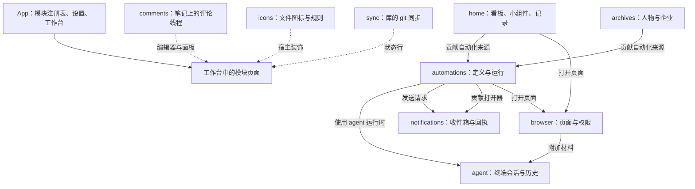

[English](context-map.md) | 简体中文

# 领域图

本图说明各模块拥有哪些数据、模块之间如何协作。源码中的 `core`、`platform`、`services`、`ui` 是代码结构，与这里的领域划分不对应。适用于整个产品的术语见[文档入口](../.config/domain-layout.ZH.md)。

## 数据归属

| 领域 | 拥有 | 协作方式 |
|---|---|---|
| App | 模块开关、语言、主题、工作台布局、导航、设置页 | 清单、服务、贡献点 |
| home | 看板、卡片、待办、小组件、快捷操作引用，习惯、记账、番茄钟与阅读记录 | 贡献 `automations.sources`；提供 `home.workbench` |
| agent | 终端辅助进程、会话、权威缓冲、原生历史索引、Agent 启动目录 | 提供 `agent.sessions`、`agent.workbench`、`agent.automation-runtime` |
| browser | 页面、分区、站点权限、恢复元数据、Agent 桥 | 提供 `browser.open` 与 `browser.agent-bridge`；通过 `agent.sessions` 附加材料 |
| archives | 人物、企业、履历、关系、目录附件 | 贡献 `automations.sources` |
| automations | 自动化定义、调度游标、运行记录 | 使用 `agent.automation-runtime`；贡献 `notifications.openers`；提供 `automations.ui` |
| notifications | 收件箱与投递回执 | 提供 `notifications.inbox` |
| icons | 图标规则、偏好、备份 | 模块启用期间装饰宿主界面 |
| comments | 线程、锚点、消息正文 | 提供 `comments.panel` 与 `comments.index`；编辑器扩展 |
| sync | 库的 git 仓库状态、提交／拉取／推送运行、每台设备的同步计时 | 提供 `sync.workbench` |

多个领域显示在同一个工作台里，不改变它们数据的归属。

## home

- **看板文档**：用户选择的 Markdown 笔记，包含横幅、栏目、卡片、待办和小组件。
- **受管区域**：笔记中由 NAND 原地更新的部分。区域之外的内容属于用户。
- **快捷操作引用**：指向自动化定义的稳定编号，不复制参数和运行状态。
- **小组件**：某个领域服务的一种呈现。关闭面板不会删除记录。
- **记录**：习惯、记账、番茄钟和阅读。它们是 home 模块的页面（功能 `records`），不是独立模块。实体文档保存习惯、书籍这类稳定身份；按日记录文件按领域、年份和日期拆分，每条记录有稳定的行编号。
- **文档基线**：开始编辑时观察到的内容，用于与当前编辑内容、磁盘上的最新内容做三方比较。
- **保存状态**：已保存、保存中、未保存或冲突。保存失败不会显示为已保存。
- **逻辑删除**：保留文档并设置 `nand-deleted`，不删除业务文件。
- **恢复草稿**：保存失败时保留的输入，不是已提交的记录。

## agent

- **终端辅助进程**：MIT 许可的原生程序 `nand-pty`，通过 stdio 帧创建并驱动伪终端。二进制按平台从同版本的 Release 下载，并用 SHA-256 文件校验。
- **原生会话**：会话管理器持有的 PTY 及其 CLI 状态，生命周期独立于叶子和页面。
- **权威缓冲**：headless xterm 模型解析后的终端输出。可见视图先重放它，再显示实时输出。
- **原生历史**：各 CLI 自己拥有的日志和恢复协议。NAND 只读取当前库范围内的部分，从不修改。
- **上下文材料**：网页、元素、截图、笔记或档案引用。它被粘贴到目标会话的输入里，但不会提交；附加前先显示目标会话。
- **未知状态**：没有可靠的原生事件或数据。NAND 不会因为没有输出就推断成功。
- **Agent 目录**：NAND 可以检测和启动的 CLI：Claude Code、Codex、Gemini CLI、OpenCode、Pi 和 Grok。

## browser

- **分区**：同一个库的标签页、弹窗和登录窗口共用的 Electron 会话边界（`persist:nand-browser-<库编号>`）。
- **页面身份**：页面实例及其版本。旧实例的结果不会写入新页面。
- **元素引用**：只在某一次快照内有效的引用。导航或版本变化后需要重新采集快照。
- **站点权限**：按来源记录的决定。敏感权限在未授权时拒绝。
- **页面退役**：取消或崩溃之后，无法安全使用的 guest 被释放，需要时再创建新页面。

## archives

- **条目**：具有稳定 `nand-id` 的人物或企业。同名不代表同一身份。
- **条目目录**：分类（人物为 `个人档案`，企业为 `企业档案`）下一层的目录，内含 `基本信息.md` 及相关资料。
- **履历**：人物的任职记录，现任或曾任是明确字段。
- **关系**：记录在人物上。反向视图和企业的成员列表由推导得到。
- **附件归属**：由所在目录决定。搜索和列表使用增量索引。

## automations 与 notifications

- **独立定义**：`NAND/自动化/` 下的 Markdown 文件，带稳定编号、动作、时间和设备归属。
- **来源定义**：由看板待办、档案或小组件拥有的定义。自动化通过来源的贡献点索引并更新它。
- **手动计划**：没有时间的定义，只在显式命令下运行。
- **运行意图**：动作开始前写下的记录。重启后仍未完成的运行会变为中断，不会重放。
- **执行设备**：定义绑定的本机设备编号。复制或同步库不会转移它。
- **可见通知**：收件箱中可读、可隐藏的消息。
- **投递回执**：某次运行在各渠道的结果，与消息的可见状态分开保存。
- **未知投递**：无法确认是否送达。外部副作用不会自动重试。

## icons

- **图标领域**：文件与原生界面的图标、颜色和规则，独立于看板设置。
- **规则**：按顺序匹配、选择图标或颜色的声明。
- **独立存储**：`.nand/icons/iconic.json` 及轮换备份。全局设置只保存模块开关。

## comments

- **线程**：围绕一个锚点的评论及回复。
- **锚点**：文件、带上下文的文本引文和缓存的偏移量。无法定位的引文会把线程标为失效，需要用户显式处理。
- **旁路存储**：`.nand/editor/comments/` 下的评论 JSON，从不改写笔记。

## sync

- **仓库位置**：库所在的 git 仓库，或本设备选定的库内某个文件夹所在的仓库。
- **提交模式**：智能、仅已暂存、全部。智能模式提交已暂存的内容，只有索引为空且该选项开启时才暂存全部。
- **同步运行**：提交、拉取、推送，按步骤报告。拉取失败或有冲突时，推送停止。
- **设备同步状态**：自动同步的计时和暂停标记，保存在 git 目录内，因此不会被提交。
