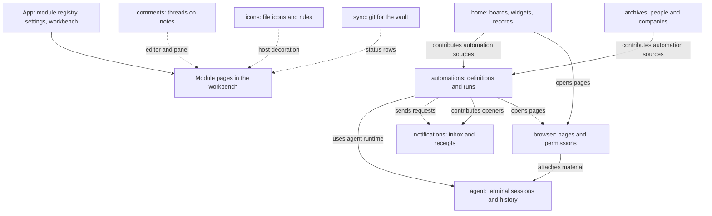

English | [简体中文](context-map.ZH.md)

# Domain map

This map states which module owns which data and how modules cooperate. The source zones (`core`, `platform`, `services`, `ui`) are a code structure and do not match these domains. Terms that apply to the whole product are in the [documentation entry](../.config/domain-layout.md).

## Ownership

| Domain | Owns | Cooperates through |
|---|---|---|
| App | Module switches, language, theme, workbench layout, navigation, settings pages | Manifests, services, contribution points |
| home | Boards, cards, todos, widgets, quick action references, habit, expense, pomodoro and reading records | Contributes `automations.sources`; provides `home.workbench` |
| agent | The terminal helper, sessions, the authoritative buffer, native history index, agent launch catalog | Provides `agent.sessions`, `agent.workbench` and `agent.automation-runtime` |
| browser | Pages, partitions, site permissions, restore metadata, the agent bridge | Provides `browser.open` and `browser.agent-bridge`; uses `agent.sessions` to attach material |
| archives | People, companies, employments, relations, folder attachments | Contributes `automations.sources` |
| automations | Automation definitions, schedule cursors, run records | Uses `agent.automation-runtime`; contributes `notifications.openers`; provides `automations.ui` |
| notifications | The inbox and delivery receipts | Provides `notifications.inbox` |
| icons | Icon rules, preferences, backups | Host decoration while active |
| comments | Threads, anchors, message bodies | Provides `comments.panel` and `comments.index`; editor extension |
| sync | The git repository state of the vault, commit, pull and push runs, per-device sync clock | Provides `sync.workbench` |

Showing several domains in one workbench does not change who owns their data.

## home

- **Board document**: a Markdown note chosen by the user. It holds a banner, sections, cards, todos and widgets.
- **Managed region**: the part of a note that NAND updates in place. Anything outside it belongs to the user.
- **Quick action reference**: the stable id of an automation definition. It does not copy parameters or run state.
- **Widget**: one presentation of a domain service. Closing a panel does not delete records.
- **Records**: habits, expenses, pomodoro sessions and reading. They are pages of the home module (feature `records`), not a separate module. Entity documents hold stable identities such as a habit or a book; per-day record files are split by domain, year and date, and each record has a stable row id.
- **Document baseline**: the content observed when editing started. It is the base of a three-way comparison with the current edit and the latest content on disk.
- **Save state**: saved, saving, unsaved or conflict. A failed save is never shown as saved.
- **Logical delete**: the document is kept and gets `nand-deleted`; the business file is not removed.
- **Recovery draft**: the input kept when a save fails. It is not a committed record.

## agent

- **Terminal helper**: the MIT native program `nand-pty` that creates and drives pseudo-terminals over stdio frames. Its binary is downloaded per platform from the release of the same version and checked against a SHA-256 file.
- **Native session**: a PTY and its CLI state held by the session manager. Its lifetime is independent of leaves and pages.
- **Authoritative buffer**: the terminal output parsed by a headless xterm model. A visible view replays it before showing live output.
- **Native history**: logs and resume protocols owned by each CLI. NAND reads them, limited to the current vault, and never modifies them.
- **Context material**: a web page, an element, a screenshot, a note or an archive reference. It is pasted into the target session's input without being submitted. The target session is shown before attaching.
- **Unknown state**: no reliable native event or data exists. NAND does not infer success from silence.
- **Agent catalog**: the CLIs NAND can launch and detect: Claude Code, Codex, Gemini CLI, OpenCode, Pi and Grok.

## browser

- **Partition**: the Electron session boundary shared by the vault's tabs, popups and sign-in windows (`persist:nand-browser-<vault id>`).
- **Page identity**: a page instance and its version. A result from an old instance never writes into a new page.
- **Element reference**: a reference valid inside one snapshot. Navigation or a version change requires a new snapshot.
- **Site permission**: a decision recorded per origin. Sensitive permissions are denied unless granted.
- **Page retirement**: after cancellation or a crash, a guest that cannot be used safely is released and a new page is created on demand.

## archives

- **Entry**: a person or a company with a stable `nand-id`. The same name is not the same identity.
- **Entry folder**: the folder one level below a category (`个人档案` for people, `企业档案` for companies) holding `基本信息.md` and related material.
- **Employment**: a person's career record with an explicit current or former flag.
- **Relation**: recorded on the person. Reverse views and a company's member list are derived.
- **Attachment ownership**: decided by the folder. Search and lists use an incremental index.

## automations and notifications

- **Standalone definition**: a Markdown file with a stable id, an action, a schedule and a device owner, under `NAND/自动化/`.
- **Source definition**: a definition owned by a board todo, an archive or a widget. Automations index and update it through the source's contribution.
- **Manual plan**: a definition without a time. It runs only on an explicit command.
- **Run intent**: the record written before an action starts. A run that is still pending after a restart becomes interrupted and is not replayed.
- **Executing device**: the local device id a definition is bound to. Copying or syncing the vault does not move it.
- **Visible notification**: a readable and hideable message in the inbox.
- **Delivery receipt**: the channel result of one run, stored apart from the message's visible state.
- **Unknown delivery**: delivery could not be confirmed. External side effects are not retried automatically.

## icons

- **Icon domain**: icons, colors and rules for files and native UI, independent of board settings.
- **Rule**: a declaration matched in order that selects an icon or color.
- **Independent store**: `.nand/icons/iconic.json` with rotating backups. The global settings only keep the module switch.

## comments

- **Thread**: a comment and its replies attached to one anchor.
- **Anchor**: a file, a text quote with surrounding context and cached offsets. A quote that cannot be located marks the thread orphaned and needs an explicit action.
- **Sidecar storage**: comment JSON under `.nand/editor/comments/`. The note is never rewritten.

## sync

- **Repository place**: the git repository around the vault, or around a folder inside it chosen on this device.
- **Commit mode**: smart, staged only, or all. Smart commits what is staged and stages everything only when the index is empty and that option is on.
- **Sync run**: commit, pull and push reported as steps. A failed or conflicted pull stops the push.
- **Device sync state**: the automatic-sync clock and pause flag, kept inside the git directory so they are never committed.
